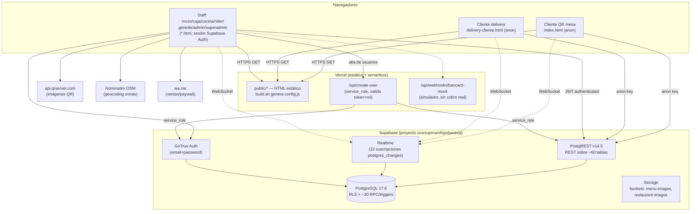

# MYTHOS — REPORTE TÉCNICO INTEGRAL DEL SISTEMA

> Reporte de auditoría técnica generado para el ARQUITECTO del proyecto (ChatGPT).
> Toda la información fue verificada leyendo el código real del repositorio.
> Convenciones de estado: ✅ COMPLETO · 🟡 PARCIAL · ❌ NO IMPLEMENTADO.
> Los secretos aparecen siempre como `[REDACTADO]`.

---

## 0. METADATOS

| Campo | Valor |
|---|---|
| Fecha de generación | 2026-06-11 |
| Branch | `main` (working tree limpio al momento de la auditoría) |
| Último commit | `16d304721b02cd53ffaaaf7ec3f115c28330b251` — `feat(admin+superadmin): módulo Paneles — accesos por QR/link + paywall de planes` (2026-06-08) |
| Versión del proyecto | `1.0.0` (`package.json`, nombre `mythos-saas`) |
| Repo remoto | `github.com/mancuellorenato/version-1.0` (según `docs/auditoria_contexto_ia.md`) |
| Proyecto Supabase vinculado | ref `ocwzupmamfojvdywavqi` (nombre "mesa-app", región `aws-1-sa-east-1`) — `supabase/.temp/linked-project.json` |
| Proyecto Vercel | `mythos` (`.vercel/project.json`), antes "mesa-app"; URL prod `mythos-pos.vercel.app` |
| Estado de la plataforma | Reset a fábrica el 2026-06-05 (migración 096). El 2026-06-08 se ejecutó un simulacro que dejó **3 restaurantes de prueba + 15 usuarios `*@mythos.test` VIVOS en producción** (teardown pendiente en `_simulacion/99_teardown.sql`, carpeta gitignored) |

---

## 1. RESUMEN EJECUTIVO

**Mythos** es un ecosistema SaaS gastronómico multi-restaurante para el mercado paraguayo (moneda única: guaraní ₲). Cubre el ciclo operativo completo de un restaurante: el cliente pide desde el QR de su mesa o por delivery web, la cocina recibe los tickets en un KDS en tiempo real, el mozo gestiona mesas y entregas físicas, la caja cobra con turnos/arqueo (incluso offline), el gerente supervisa, el administrador del local gestiona menú/mesas/personal/stock/finanzas, y un superadmin SaaS administra restaurantes, planes de suscripción, add-ons y soporte. Sirve a dueños de restaurantes (clientes del SaaS) y a Mythos como plataforma (modelo de suscripción mensual + add-ons).

**Estado global:** el núcleo operativo (cliente → cocina → mozo → caja, delivery completo con rider, turnos de caja, stock, planes con límites y gating) está construido y fue validado en un simulacro multi-tenant sobre la base de producción (`_simulacion/INFORME.md`: 0 descuadres, 0 huérfanos). Lo que falta es lo que separa un prototipo avanzado de un producto comercial: pagos reales (Bancard/Tigo Money), factura electrónica SIFEN, CRM de clientes (UI sin tabla), cierre definitivo del agujero RLS del rol `anon` a nivel de fila, automatización del ciclo de suscripción, y **cero tests automatizados**.

**Avance estimado hacia un producto usable en producción: ~70%.** (Operación interna del restaurante ~90%; monetización/pagos ~35%; seguridad multi-tenant ~65%; calidad/QA automatizado ~5%.)

**Los 5 puntos que el arquitecto debe saber antes de leer el resto:**

1. **No hay bundler ni framework de build por decisión arquitectónica explícita** (regla en `CLAUDE.md`). Cada panel es un único archivo HTML con React 18 UMD + Babel Standalone por CDN; el JSX se transpila en el navegador en cada carga. `public/admin.html` tiene **9.685 líneas** en un solo archivo. No usar `import/export`; todo es `window.*`.
2. **No existe backend propio salvo 2 funciones serverless de Vercel** (`api/create-user.js` y `api/webhooks/bancard-mock.js`). Toda la lógica de negocio vive en el frontend + ~30 funciones RPC/trigger de PostgreSQL. La seguridad real es Row Level Security de Supabase.
3. **La RLS está a medio endurecer:** el lado autenticado está aislado por restaurante (migraciones 086/088/092) y el rol `anon` ya no puede leer PII ni alterar pedidos (migración 102, a nivel de privilegio de columna), pero **decenas de tablas conservan políticas `USING(true)`** que permiten lectura/escritura cross-tenant tanto a `anon` (filas no-PII) como a `authenticated` (tablas no cubiertas por 086/092: proveedores, bitácoras, sesiones de personal, payments, etc.).
4. **La monetización está modelada pero no cobra:** planes Starter/Pro/Enterprise en ₲ con `allowed_panels`, `allowed_features`, `max_users_by_role` (límite de usuarios con trigger server-side real) y add-ons. Pero los límites de mesas/ítems solo se validan en frontend, los 3 planes tienen `allowed_features` idénticos (el paywall por feature nunca dispara), y no hay pasarela de pago: los cobros de suscripción se registran a mano.
5. **No hay ni un test, ni linter, ni CI de calidad.** El QA del proyecto son simulacros SQL documentados y verificación manual en navegador. El deploy es `git push` → Vercel; las migraciones de DB se aplican a mano en el SQL Editor de Supabase (dashboard en inglés, regla del proyecto).

---

## 2. STACK TECNOLÓGICO EXACTO

No hay `package.json` con dependencias de runtime (el root `package.json` solo declara `engines.node >= 18`). Las versiones del frontend están fijadas en los tags `<script>` de cada panel; las del backend provienen de `supabase/.temp/*`.

| Capa | Tecnología | Versión exacta | Evidencia |
|---|---|---|---|
| UI runtime | React (UMD producción) | `18.3.1` | `https://unpkg.com/react@18.3.1/...` en los 9 paneles React |
| UI runtime | ReactDOM (UMD) | `18.3.1` | ídem |
| Transpilación en navegador | @babel/standalone | `7.29.0` | `https://unpkg.com/@babel/standalone@7.29.0/babel.min.js` |
| Cliente de datos | @supabase/supabase-js (UMD) | `@2` ⚠️ **sin pin de versión exacta** (`supabase-js@2/dist/umd/supabase.min.js`) | todos los paneles |
| Mapas (solo admin → zonas delivery) | Leaflet | `1.9.4` | `public/admin.html` |
| Generación de QR (imágenes) | api.qrserver.com (servicio externo, no librería) | v1 | `admin.html`, `caja.html`, `superadmin.html` |
| Base de datos | PostgreSQL (Supabase) | `17.6.1.111` | `supabase/.temp/postgres-version` |
| API REST de datos | PostgREST (Supabase) | `v14.5` | `supabase/.temp/rest-version` |
| Auth | GoTrue (Supabase Auth) | `v2.189.0` | `supabase/.temp/gotrue-version` |
| Storage | Supabase Storage | `v1.54.0` | `supabase/.temp/storage-version` |
| CLI de migraciones | Supabase CLI | `v2.95.4` | `supabase/.temp/cli-latest` |
| Hosting + funciones serverless | Vercel (Node ≥18) | runtime Node por defecto | `vercel.json`, `api/*.js` |
| Build | `build.sh` (bash, 23 líneas — solo genera `public/config.js`) | n/a | `build.sh` |
| Estilos | CSS-in-JS inline + tokens globales | n/a | `public/design-system.css` (418 líneas, "Design System v2.0") |
| PWA / offline | Service Worker artesanal | n/a | `public/sw.js` (32 líneas, cache-first fallback para caja) |
| Tooling local (no deploy) | pdfkit | `^0.18.0` | `pdfgen/package.json` (genera `analisis_mythos_v1.pdf`) |

**Riesgo de stack:** los 4 CDNs (unpkg ×3, jsdelivr ×1) son dependencias de runtime en producción — si unpkg cae, caen todos los paneles. `supabase-js@2` sin pin significa que una publicación de Supabase puede cambiar el comportamiento sin ningún cambio en el repo.

---

## 3. ARQUITECTURA GENERAL

**Patrón:** *Multi-SPA estática + BaaS (Backend-as-a-Service)*. No hay servidor de aplicación. Cada panel es una SPA independiente en un único archivo HTML que habla directamente con Supabase (PostgREST + Realtime + Auth + Storage) usando la anon key pública. Las dos únicas piezas server-side propias son funciones serverless de Vercel.



**Cómo viaja una petición típica (pedido de mesa):**
1. El cliente escanea el QR → `index.html?r=<restaurant_id>&t=<table_number>`. `RESTAURANT_ID` se resuelve de `?r=`, o de `SUPABASE_CONFIG.restaurantId` ([index.html:69](public/index.html#L69)). **No existe restaurante por defecto** (regla post-migración 096).
2. `join_table_session(table_id)` (RPC `SECURITY DEFINER`, [074](supabase/migrations/20260526_074_table_scan_sessions.sql)) valida capacidad de la mesa y abre/incrementa la sesión de escaneo; `get_table_upcoming_reservation` avisa si la mesa tiene reserva próxima.
3. El menú se lee con la anon key vía PostgREST (`menu_categories`, `menu_items` + `menu_item_extras` embebidos) y se suscribe al canal Realtime `menu-live` para refrescar en vivo.
4. Al confirmar, el frontend hace 4 INSERTs encadenados: `orders` (status `paid`, `order_number` `'T-' + (Date.now()%90000+10000)` — [index.html:119](public/index.html#L119)), `order_items`, `order_item_extras`, `order_status_history`.
5. El trigger `trg_deduct_stock_on_status_history` ([018](supabase/migrations/20260504_018_fix_stock_trigger.sql)) descuenta stock por receta si `restaurant_settings.auto_stock_discount` está activo ([083](supabase/migrations/20260526_083_stock_sessions.sql)); `trg_occupy_table` ocupa la mesa.
6. `cocina.html` recibe el INSERT por Realtime (`cocina-realtime-v2`) y muestra el ticket en el kanban; cada cambio de estado hace `PATCH /orders` + INSERT en `order_status_history`.
7. El cliente sigue el pedido en `TrackingScreen` por Realtime (canal `track-<order_number>`) **más polling de respaldo cada 10 s y reconexión al volver del background** ([index.html:1180-1218](public/index.html#L1180-L1218)).
8. La caja cobra (si quedó `pending_payment`), registra `movimientos_caja` dentro del `turno_caja` abierto, y libera la mesa explícitamente (nunca automático — trigger de auto-liberación eliminado en [054](supabase/migrations/20260520_054_no_auto_release_mesa.sql)).

**Decisiones de diseño visibles en el código y su porqué aparente:**

| Decisión | Porqué (documentado o aparente) |
|---|---|
| Sin bundler, un HTML por panel | Velocidad de iteración en MVP; deploy estático inmediato; el dueño puede editar HTML directo (`docs/ARCHITECTURE.md`). Congelado como regla en `CLAUDE.md`. |
| Snapshots de nombre/precio en `order_items`, nombres en `*_name` por toda la DB | Historial inmune a cambios/borrados de menú y usuarios (`docs/ARCHITECTURE.md`; patrón repetido en caja, delivery, proveedores). |
| Estado de pago separado del estado de elaboración (`orders.payment_status` vs `orders.status`) | La caja puede cobrar antes o después de cocinar ([053](supabase/migrations/20260520_053_payment_status.sql)). |
| Entrega física separada (`delivered_to_table_at`) | Distinguir "cocina despachó" de "el mozo llevó el plato" ([067](supabase/migrations/20260522_067_orders_delivered_to_table.sql)). |
| Mesa se libera SOLO explícitamente | Evitar liberar mesas con clientes sentados ([054](supabase/migrations/20260520_054_no_auto_release_mesa.sql)). |
| Validaciones críticas duplicadas en DB (triggers `enforce_role_user_limit`, `enforce_branch_limit`) | El frontend es manipulable; la DB es el backstop ([090](supabase/migrations/20260527_090_plan_limits_and_addons.sql), [092](supabase/migrations/20260527_092_multi_sucursal.sql)). Solo cubre usuarios y sucursales, **no** mesas/ítems. |
| Sesión por inactividad (1 h) implementada a mano | Supabase no expira sesiones por inactividad; `public/mythos-session.js` lo resuelve compartiendo `mythos_last_activity` entre pestañas. |
| Gating de planes **fail-open** | Si la RPC de capacidades falta o el plan es legacy, no se bloquea nada (`public/mythos-gating.js:43-47`) — prioriza no romper la operación sobre la monetización. |

---

## 4. ESTRUCTURA DE CARPETAS

Árbol completo de archivos trackeados por git (se omiten `node_modules`, `.git`, artefactos gitignored — listados aparte al final):

```
version 1.0/
├── CLAUDE.md                      # Instrucciones de contexto para agentes IA (estado, reglas, prioridades)
├── SENSITIVE_DATA.md              # Política de manejo de credenciales (NO contiene valores reales — verificado)
├── SPRINT1_RESUMEN.md             # Resumen Sprint 1: saneo de migraciones, RLS 086, Bancard 087, login localStorage
├── SPRINT2_RESUMEN.md             # Resumen Sprint 2: bypass superadmin 088, guardias de panel, flags Bancard/SIFEN
├── package.json                   # Solo metadata (mythos-saas v1.0.0, node>=18); sin dependencias
├── build.sh                       # Build de Vercel: genera public/config.js desde env vars (con strip de BOM)
├── vercel.json                    # outputDirectory public/, rewrites de rutas limpias, headers de seguridad
├── 02_v1_paso_a_paso.pdf          # Documento histórico del plan v1 (PDF)
├── analisis_mythos_v1.pdf         # PDF de auditoría generado por pdfgen/
├── skills-lock.json               # Lockfile de skills de agentes IA
│
├── api/                           # ÚNICO backend propio (Vercel Serverless Functions)
│   ├── create-user.js             # POST /api/create-user — alta segura de usuarios con service_role (215 líneas)
│   └── webhooks/
│       └── bancard-mock.js        # POST /api/webhooks/bancard-mock — simulador de webhook Bancard (72 líneas)
│
├── public/                        # TODO el frontend (deploy estático completo)
│   ├── index.html                 # Panel cliente QR mesa (1.965 líneas)
│   ├── delivery-cliente.html      # Panel cliente delivery (2.065)
│   ├── delivery-rider.html        # Panel rider (752)
│   ├── cocina.html                # KDS cocina (1.853)
│   ├── mozo.html                  # Panel mozo (3.722)
│   ├── caja.html                  # Panel caja (4.676)
│   ├── gerente.html               # Panel gerente / supervisor_local (2.301)
│   ├── admin.html                 # Admin del restaurante (9.685 — el más grande)
│   ├── superadmin.html            # Superadmin SaaS (3.864)
│   ├── login.html                 # Login unificado (182)
│   ├── diag.html                  # Diagnóstico de conexión (99)
│   ├── config.example.js          # Plantilla de window.SUPABASE_CONFIG
│   ├── config.js                  # ⚠️ GITIGNORED — credenciales reales generadas por build.sh (existe local)
│   ├── design-system.css          # Tokens CSS globales (light/dark) — importado por todos los paneles
│   ├── mythos-theme.js            # Modo claro/oscuro FIJO por panel (toggle global deshabilitado)
│   ├── mythos-icons.js            # ~75 íconos SVG inline estilo Lucide (window.MythosIcons)
│   ├── mythos-session.js          # Cierre de sesión por 1 h de inactividad (todos los paneles de personal)
│   ├── mythos-presence.js         # Registro login/logout en staff_sessions (sin heartbeat, por decisión)
│   ├── mythos-offline.js          # Overlay "Sin conexión"+Reintentar (todos los paneles salvo caja/diag)
│   ├── mythos-gating.js           # Omni-Gating por feature + paywall FeatureLock (window.MythosGating)
│   ├── sw.js                      # Service worker: cache-first para que caja imprima tickets offline
│   └── tweaks-panel.jsx           # Shell de tweaks en vivo para prototipos (solo lo carga index.html)
│
├── supabase/
│   ├── migrations/                # 107 archivos SQL numerados 001→102 (con sufijos b por colisiones)
│   │   ├── 20260429_001_schema.sql        # Schema base: restaurants, tables, menú, orders, ratings...
│   │   ├── ...                            # (detalle completo en sección 7)
│   │   └── 20260608_102_anon_pii_lockdown.sql  # Última: blindaje de PII contra rol anon
│   │   └── 20260501_FULL_SETUP.sql.bak    # Rollup histórico 001-008, ignorado por el CLI
│   └── .temp/                     # GITIGNORED — metadata del CLI (versiones, project ref, pooler url)
│
├── docs/                          # Documentación (parcialmente DESACTUALIZADA — ver nota)
│   ├── README.md, ARCHITECTURE.md, DATABASE_SCHEMA.md, DEPLOYMENT.md, SUPABASE_SETUP.md
│   ├── auditoria_contexto_ia.md   # Versión larga del contexto IA (última act. 2026-05-16)
│   ├── guia-supabase-datos.md/pdf, guia-supabase-estadisticas.html
│   ├── diagrama-sistema.html, sistema-completo-v1.html
│   └── (⚠️ ARCHITECTURE/DATABASE_SCHEMA/DEPLOYMENT describen el MVP de abril — no reflejan
│        delivery, caja, planes, multi-sucursal ni el reset 096. La fuente fiable es CLAUDE.md + migraciones.)
│
├── pdfgen/                        # Tooling local: genera analisis_mythos_v1.pdf con pdfkit (no se deploya)
│   ├── generate.js (1.367 líneas), package.json, package-lock.json
│
├── scripts/
│   └── migrar-colores.js          # Script one-shot: migración de paleta dark→light en los HTML
│
├── .claude/skills/                # Skills de contexto para agentes IA
│   ├── mythos-context/SKILL.md    # Contexto extendido del proyecto (210 líneas)
│   └── mythos-ui/SKILL.md         # Design system / reglas de UI (583 líneas)
├── .agents/skills/find-skills/SKILL.md
├── .env.example                   # Nombres de variables (sin valores)
└── .gitignore                     # Protege config.js, .env*, _simulacion/, .vercel, etc.
```

**Presentes en disco pero GITIGNORED (no viajan a GitHub):** `public/config.js` (credenciales reales), `.env.vercel`, `.vercel/`, `_simulacion/` (9 SQL + runner PowerShell + `INFORME.md` del simulacro — contiene contraseñas de cuentas de prueba), `EJECUTAR_EN_SUPABASE.sql` (helper copy-paste), `design.gz`, `Mesa_App.html`, `design_extracted/` (artefactos del diseño original), `supabase/.temp/`.

---

## 5. PANELES E INTERFACES — UNO POR UNO

Hay **11 paneles HTML** (9 con React, 2 vanilla JS: login y diag). Patrón común de los paneles de personal: guardia pre-React que verifica `localStorage.mythos_restaurant_id` (salvo superadmin) y redirige a `login.html` ([SPRINT2_RESUMEN.md](SPRINT2_RESUMEN.md)); después, guardia async que valida la sesión Supabase + rol vía RPC `get_my_profile`. Todos cargan `design-system.css`, `mythos-theme.js`, `mythos-offline.js` (salvo caja/diag) y los paneles de personal suman `mythos-session.js` + `mythos-presence.js`.

### 5.1 Cliente QR de mesa — `public/index.html` (1.965 líneas) ✅ COMPLETO

- **Propósito:** el comensal escanea el QR de su mesa, ve el menú, arma el carrito, "paga" (registra método), sigue el pedido en vivo, califica y puede pedir factura.
- **URL:** `/` (raíz) con `?r=<restaurant_id>&t=<n_mesa>` (o `?mesa=`). Acceso: **anónimo** (anon key). Sin `?r=` y sin `restaurantId` en config lanza error explícito ([index.html:114](public/index.html#L114)).
- **Pantallas (componentes reales):** `QRScreen` (simulación de escaneo), `QRCheckingScreen`, `MesaLlenaScreen` (rechazo si `join_table_session` devuelve mesa llena), `MesaReservadaScreen` (si `get_table_upcoming_reservation` detecta reserva próxima), `GateScreen`, `ProfileScreen` (datos del cliente + `requires_invoice`), `MenuScreen` + `ProdCard` + `ProductModal` (extras), `CartScreen` + `SplitBillModal` (división de cuenta), `PayScreen` (efectivo/QR/POS; tarjeta "Pagar desde el celular" Bancard con badge PRÓXIMAMENTE), `TrackingScreen` (6 pasos, Realtime + polling 10 s), `RatingScreen` (1-5 estrellas + comentario), `ReservationScreen` (crear reserva con `confirm_num`).
- **Datos:** lee `restaurants, tables, menu_categories, menu_items(+extras), coupons, reservations`; escribe `orders, order_items, order_item_extras, order_status_history, waiter_calls, ratings, reservations`. RPCs: `join_table_session`, `get_table_upcoming_reservation`. Realtime: `menu-live`, `track-<order_number>`.
- **Detalles:** carrito persistente, validación anti-pedido ₲0, llamada al mozo (`waiter_calls` con `type` assistance/payment_request), solicitud de factura (`invoice_delivery_method` print/email). Único panel que carga `tweaks-panel.jsx` (herramienta de diseño en vivo).
- **Estado:** ✅ por pantalla. Nota de honestidad: `CLAUDE.md` lista "Tracking cliente en index.html — Realtime parcial, mesa aún no" como bug #2, pero el código actual en [index.html:1180-1218](public/index.html#L1180-L1218) **ya implementa** Realtime + polling fallback + reconexión `visibilitychange` — la doc está desactualizada, no el código.

### 5.2 Cliente delivery — `public/delivery-cliente.html` (2.065 líneas) ✅ COMPLETO (con pagos online ❌)

- **Propósito:** pedido a domicilio o pickup sin login, con verificación de cobertura por zonas y tracking del rider en vivo.
- **URL:** `/delivery-cliente.html?r=<restaurant_id>`. Acceso: **anónimo**.
- **Pantallas:** `WelcomeScreen`, `CoverageScreen` (valida dirección contra `delivery_zones` con cálculo haversine; badge fijo "Google Maps en modo demostración"), `MenuScreen`/`ProdCard`/`ProductModal`, `CartScreen`, `CustomerDataScreen` (nombre, teléfono, dirección, referencias, `cash_amount` para vuelto), `PayScreen` (efectivo/POS; "Pago Online Bancard" PRÓXIMAMENTE), `ConfirmScreen` (tracking con estados del rider), `ReservaScreen`.
- **Datos:** escribe `orders` + `delivery_orders` (vinculadas por `order_id`); lee `delivery_zones`, `delivery_riders` (nombre del rider asignado). Realtime `dc-delord-*`/`dc-track-*` + polling 12 s.
- **Flujo de estados que ve el cliente:** `delivery_orders.rider_status`: `pending → confirmed → picked_up → on_way → delivered`.
- **Estado:** ✅ flujo completo verificado en simulacro. ❌ pago online. 🟡 geocoding: solo estimación por zonas (sin Google Maps key).

### 5.3 Panel rider — `public/delivery-rider.html` (752 líneas) ✅ COMPLETO

- **Propósito:** el repartidor ve sus pedidos asignados, inicia ruta, confirma entregas y consulta su historial/comisiones.
- **URL:** `/delivery-rider.html`. Acceso: rol `rider` con **login por correo+contraseña** (migración 101); el panel resuelve su ficha con `delivery_riders.user_id = auth.uid()` ([delivery-rider.html:591-602](public/delivery-rider.html#L591-L602)). El login por PIN fue eliminado (PINs vaciados a NULL).
- **Pantallas:** `HomeScreen` (pedidos `rider_status='confirmed'`, toggle disponible/offline), `RouteScreen` (pedidos `on_way`, botón "Entregado" que marca `delivered` + vuelve al rider `disponible`), `HistoryScreen` (entregas del día + cálculo de comisión pct/fixed/salary), `ErrorScreen`. ⚠️ `PinEntryScreen` sigue definido en el código — **código muerto** del flujo PIN anterior.
- **Datos:** `delivery_riders` (estado propio), `delivery_orders` (cambio de `rider_status` + timestamps `picked_up_at`/`delivered_at`). Realtime `rider-orders-*` (requirió `REPLICA IDENTITY FULL`, migración 077). Presencia manual (`MYTHOS_PRESENCE_MANUAL=true`).
- **Estado:** ✅; código muerto PIN pendiente de limpieza.

### 5.4 KDS Cocina — `public/cocina.html` (1.853 líneas) ✅ COMPLETO

- **Propósito:** Kitchen Display System tipo kanban; recibe pedidos en tiempo real y los avanza de estado; auto-asigna riders a deliveries listos.
- **URL:** `/cocina`. Acceso: rol `cocina` (o admin/superadmin). **Modo estación:** `?station=<access_token>` restringe la vista a las categorías/zonas de una `kitchen_station` específica (link compartible sin selección manual) — [cocina.html:67-85](public/cocina.html#L67-L85).
- **Vistas/áreas:** tablero de 3 columnas (`Column` Nuevos `paid/kitchen_received` → Preparando `cooking` → Listos `ready`), `TicketCard` (con extras, observaciones, tipo de pedido, urgencia por tiempo), `StationTabs`, `OrderTypeFilterTabs` (mesa/delivery/llevar), `StatsPanel`, `FelicitacionesPanel` (ratings ≥4 en vivo, canal `ratings-feliz`), `KitchenMessageBanner` (mensajes de `kitchen_messages` rotando según `restaurant_settings.kitchen_message_frequency`), `ConfigDrawer`, `Clock`.
- **Lógica clave:** al marcar listo un delivery, ejecuta auto-asignación de rider **round-robin** (busca rider activo `disponible` con asignación más antigua) y setea `rider_status='confirmed'` (patrón de migración 057). Registra auditoría por ítem en `order_item_station_log`.
- **Datos:** `orders, order_items(+extras), order_status_history, delivery_orders, delivery_riders, kitchen_stations(+categories/zonas), kitchen_messages, stock_alerts, staff_broadcasts, ratings, restaurant_settings`. Realtime `cocina-realtime-v2`, `bc-cocina`, `ratings-feliz`.
- **Estado:** ✅.

### 5.5 Panel mozo — `public/mozo.html` (3.722 líneas) ✅ COMPLETO

- **Propósito:** vista del salón para el mozo: mesas con estado, llamadas de clientes, toma de pedidos, entrega física, cobro en mesa y cierre de turno con deudas.
- **URL:** `/mozo`. Acceso: rol `mozo` (+admin/superadmin). Componente `App` **monolítico** (solo 3 funciones componente: `App`, `ZonaMozo`, `MesaEditModalM`) — toda la lógica vive en un solo componente gigante.
- **Funcionalidad verificada en código:** mapa de mesas por zona con coordenadas virtuales 0-1000 ([066](supabase/migrations/20260522_066_tables_virtual_coords.sql)); toggle **"Mis mesas / Todas"** ([mozo.html:2366-2376](public/mozo.html#L2366)); **transferencia de mesas entre mozos** con modal y notificación vía `waiter_calls.metadata` ([mozo.html:3469+](public/mozo.html#L3469)); atención de llamadas (assistance / payment_request); crear pedido por mesa ("Pedir más" pasa por cocina); marcar entrega física (`delivered_to_table_at`); cobro con métodos incl. `pos_mesa` ("QR digital" gated PRÓXIMAMENTE); **"Terminar turno"** que detecta órdenes no cobradas y genera `waiter_debts` ([mozo.html:1617-1621](public/mozo.html#L1617), [mozo.html:2834-2848](public/mozo.html#L2834)); reservas del día; avisos (`staff_broadcasts`); filtro de deudas por `occupied_since` para no arrastrar sesiones anteriores.
- **Datos:** `orders` (25 usos), `tables`, `waiter_calls`, `order_status_history`, `reservations`, `menu_*`. Realtime `mozo-live`, `bc-mozo`.
- **Estado:** ✅ funcional; 🟡 deuda técnica: monolito de un componente, difícil de mantener.

### 5.6 Panel caja — `public/caja.html` (4.676 líneas) ✅ COMPLETO (Bancard/SIFEN ❌ reales)

- **Propósito:** POS y caja del local: turnos con arqueo, cobros multi-método, facturación simple, cancelaciones, retiros, quejas, reportes X/Z. **Único panel con modo offline** (service worker + cola local).
- **URL:** `/caja`. Acceso: rol `cajero` (+admin/superadmin). Sesión persistente en localStorage (la sesión por pestaña fue **revertida** el 2026-06-08); apertura de turno deriva `restaurant_id` de la identidad autenticada y re-sincroniza el cache local ([caja.html:388-399](public/caja.html#L388)).
- **Pantallas:** `AperturaTurnoScreen` (fondo por denominaciones; modo `fijo`/`libre` según `restaurants.cash_mode_default`, [071](supabase/migrations/20260525_071_caja_config_fondo_fijo.sql)) y 12 paneles internos ([caja.html:511-522](public/caja.html#L511-L522)): **salón** (`SalonPanel`/`ZonaCaja`/`TableCard`, ocupación + liberar mesa), **tomar pedido** (`TomarPedidoPanel` POS con carrito persistente `caja_cart`, mostrador/QR), **cobros** (`CobrosPanel` + `CobroModal`: efectivo con vuelto, tarjeta, QR, mixto; botones "QR Bancard" y "VPos Bancard" → toast `BancardProximamente`; toggle SIFEN gated), **avisos**, **facturas del turno** (`FacturasCajaPanel` — facturación interna, no fiscal), **historial**, **reservas** (CRUD), **retiro de efectivo** (`RetiroPanel` con `PinAuthModal` de supervisor), **cancelaciones** (`CancelacionesPanel`/`QuickCancelModal`, parcial/total + motivo + pérdida de insumos), **ingresos/egresos manuales**, **quejas/sugerencias**, **cierre** (`CierreCajaPanel`: conteo por denominaciones, esperado vs contado, justificación de diferencia sobre umbral, reporte X/Z, logout al cerrar).
- **Offline:** `sw.js` cachea el panel; cola `mythos_offline_orders` en localStorage; al volver la red, sincroniza pedidos pendientes ([caja.html:182-186](public/caja.html#L182), [caja.html:4389-4410](public/caja.html#L4389)). Único panel SIN `mythos-offline.js` (overlay bloqueante).
- **Datos:** `turnos_caja, movimientos_caja, cancelaciones_caja, quejas_sugerencias, orders, order_items, tables, reservations, delivery_orders, waiter_calls, user_profiles` (PIN supervisor legacy). Realtime `cobros-rt`, `salon-realtime`, `caja-payment-calls`, `bc-caja`.
- **Estado:** ✅ operativa completa; ❌ Bancard real; ❌ SIFEN real (solo UI gated); 🟡 `PinAuthModal` depende de `user_profiles.pin`, tabla legacy de mozo v2 sin flujo de alta actual.

### 5.7 Panel gerente — `public/gerente.html` (2.301 líneas) ✅ COMPLETO

- **Propósito:** supervisión operativa sin poderes de configuración: aprobaciones, bitácora, quejas, caja en vivo, solicitudes de personal y soporte directo con Mythos.
- **URL:** `/gerente.html` (⚠️ **sin rewrite de ruta limpia** en `vercel.json`). Acceso: roles `gerente`/`supervisor_local` (en DB el rol real es `supervisor_local`; "gerente" es etiqueta de UI — taxonomía documentada en memoria del proyecto).
- **Páginas** ([gerente.html:2228-2240](public/gerente.html#L2228)): Dashboard (KPIs día), **Supervisión** (`SupervisionTurno` — staff conectado vía `employee_shifts`), **Aprobaciones** (`manager_approvals`: descuentos, cortesías, anulaciones... aprobar/rechazar con badge pendientes), **Quejas y ratings** (+ `Stock86`: lista 86 de productos no disponibles hoy → `item_86_list`), **Caja en vivo** (`CajaLive`: turno abierto + movimientos en vivo), **Reservas**, **Calendario** (`calendar_events`), **Bitácora** (`shift_logs`: notas/incidencias/traspasos por turno y prioridad), **Reportes del día**, **Solicitudes personal** (`staff_requests` → el admin las aprueba y crea el usuario), **Avisos al personal** (`staff_broadcasts` — solo a trabajadores, no a admin), **Soporte Mythos** (`SoporteChat` sobre `support_tickets`/`support_messages` con no-leídos).
- **Estado:** ✅; 🟡 Supervisión lee `employee_shifts` (carga manual legacy) y no `staff_sessions` (login real) — inconsistencia con Admin→Personal→Turnos.

### 5.8 Admin del restaurante — `public/admin.html` (9.685 líneas) 🟡 PARCIAL (CRM sin tabla)

- **Propósito:** centro de gestión del local: menú, mesas, personal, stock, proveedores, finanzas, delivery, estaciones, reservas, marketing, reportes, soporte y configuración. Con switcher multi-sucursal y gating por plan.
- **URL:** `/admin`. Acceso: roles `admin`, `gerente/supervisor_local`, `superadmin` ([admin.html:9678](public/admin.html#L9678)). `RID` = `localStorage.mythos_restaurant_id` con fallback a config ([admin.html:65](public/admin.html#L65)). `SucursalSwitcher` cambia `mythos_restaurant_id` y recarga ([admin.html:421-433](public/admin.html#L421)).
- **Las 22 páginas del NAV** ([admin.html:346-373](public/admin.html#L346)) — estado por pantalla:

| Página | Qué hace | Estado |
|---|---|---|
| Dashboard | KPIs del día, pedidos activos, alertas | ✅ |
| Pedidos | Listado/filtrado por tipo (general/local/delivery/llevar) y estado, detalle | ✅ |
| **Paneles** (último commit) | Tarjetas de cada panel del plan con QR/link compartible (`PanelShareModal`); paneles fuera del plan muestran `UpgradeModal` con WhatsApp de ventas | ✅ |
| Delivery (módulo) | `DelivDashboard`, `DelivPedidos`, `DelivRiders` (CRUD ficha + alta de cuenta vía `/api/create-user`), `DelivConfig` + **mapa de zonas** con Leaflet + búsqueda Nominatim (Google Places si hubiera `googleMapsKey`) | ✅ (gated `admin:delivery_zones`) |
| Menú | CRUD categorías/ítems/extras, fotos a bucket `menu-images`, promos (`promo_type`, `discount_pct`, `dine_in_only`), disponibilidad | ✅ |
| Mesas | `MapEditor` drag-and-drop coordenadas virtuales, zonas/formas, QR por mesa (`QrModal`/`QrAllModal` vía api.qrserver.com) | ✅ |
| Reservas | CRUD + verificación; ventana configurable | ✅ |
| Calendario | Eventos propios + globales del superadmin | ✅ |
| Estaciones | CRUD `kitchen_stations` + categorías/zonas + link KDS por token + `EstacionesStats`/`EstacionesAudit` | ✅ |
| Personal | Lista (`admin_list_restaurant_users`), alta vía **`/api/create-user`** (roles permitidos: cajero/mozo/cocina/rider/supervisor_local — [admin.html:111](public/admin.html#L111)), edición de rol, **Turnos = `staff_sessions`** (conexiones reales, "Sin cierre", "Forzar cierre"), solicitudes del gerente | ✅ |
| Stock | Ingredientes (RPC `admin_list_ingredients` con proyección), cargas (`admin_load_stock`), recetas, movimientos, alertas, **tomas de inventario** (`admin_create/complete_stock_session`) | ✅ (gated `admin:inventory`) |
| Proveedores | CRUD `suppliers` + contactos + compras/facturas (`supplier_purchases`) | ✅ |
| **Clientes (CRM)** | UI de listado/ranking/segmentos construida | ❌ NO IMPLEMENTADO el almacenamiento — **no existe tabla `customers`**; los datos se derivan al vuelo de `orders.customer_*` y no persisten como entidad |
| Reportes | Reportes operativos + de clientes (6 tipos: general, ranking, delivery, mesa, llevar, VIP — [admin.html:3005-3010](public/admin.html#L3005)) | ✅ (derivados de orders) |
| Facturas | Solicitudes de factura (`requires_invoice`/`invoice_status`) | 🟡 gestión interna; sin emisión fiscal |
| Finanzas | Ingresos vs `expenses` (egresos CRUD) | ✅ |
| Caja (vista) | Turnos y movimientos de caja en modo lectura/supervisión | ✅ |
| Marketing | Cupones (`coupons`) | ✅ |
| Calificaciones | Ratings con filtros | ✅ (❌ sin moderación/aprobación) |
| Avisos personal | `staff_broadcasts` a roles seleccionados | ✅ |
| Soporte | Tickets + chat con superadmin | ✅ |
| Config | Datos del local, horarios, portada/logo (bucket `restaurant-images`), fondo fijo de caja, toggles (`auto_stock_discount`...) | ✅ |

- **Realtime:** 11 canales (`pedidos-rt`, `mesas-rt`, `menu-rt`, `delivery-rt`, `stock-admin-rt`, `personal-rt`, `support-admin-rt`, `estaciones-rt`, etc.).
- **Estado global del panel:** 🟡 — funcional salvo CRM; tamaño del archivo es la principal deuda.

### 5.9 Superadmin SaaS — `public/superadmin.html` (3.864 líneas) 🟡 PARCIAL (cobros manuales)

- **Propósito:** operación de la plataforma: alta/gestión de restaurantes, planes y add-ons, usuarios, facturación del SaaS, soporte, reportes cross-tenant y configuración global.
- **URL:** `/superadmin`. Acceso: rol `superadmin` (único rol con `restaurant_id = NULL`).
- **Páginas** ([superadmin.html:2787-2797](public/superadmin.html#L2787)): **Dashboard** (KPIs plataforma + `SystemHealth`), **Paneles** (`PageSuperPaneles` + `SuperShareModal`: links/QR de cualquier panel de cualquier restaurante), **Capacidad** (`PageCapacidad`: edición de `allowed_panels`/`allowed_features`/`max_users_by_role` por plan y add-ons por restaurante — el paywall se administra acá), **Restaurantes** (alta con plan, estado active/trial/suspended, multi-sucursal parent-child, toggle abierto/cerrado, mantenimiento), **Facturación** (`subscriptions` + registro **manual** de `payments`), **Usuarios** (RPC `admin_list_users`, alta vía `/api/create-user`, toggle activo, cambio de rol), **Soporte** (`SoporteSuperChat` — bandeja de tickets de todos los locales), **Reportes** (9 tipos — [superadmin.html:2295-2303](public/superadmin.html#L2295); ⚠️ "Proveedores comunes" y "Zonas calientes" usan **datos de muestra** hardcodeados), **Actividad** (`platform_events`), **Horarios** (apertura por restaurante), **Calendario** (eventos globales `is_global`), **Configuración** (banner global de mantenimiento vía `platform_config`, Realtime).
- **Estado:** 🟡 — gestión completa; el ciclo de cobro es 100% manual y 2 reportes son fake-data.

### 5.10 Login unificado — `public/login.html` (182 líneas) ✅ COMPLETO

- Vanilla JS. `signInWithPassword(email, password)` → RPC `get_my_profile` → valida rol y tenancy (roles operativos exigen `restaurant_id`; superadmin no) → guarda `mythos_role/restaurant_id/user_id/display_name/last_activity` en localStorage → redirige por rol (`homeForRole`, [login.html:102-117](public/login.html#L102)): superadmin→superadmin, admin→admin, gerente/supervisor_local→gerente, cajero→caja, mozo→mozo, cocina→cocina, rider→delivery-rider. Rol desconocido o sin comercio → signOut + error. Sesión activa previa se revalida y redirige sola.

### 5.11 Diagnóstico — `public/diag.html` (99 líneas) ✅ COMPLETO

- Herramienta interna: verifica `config.js`, conexión a Supabase, lectura de `restaurants`/`orders` y pedidos visibles en cocina. ⚠️ Expone URL y prefijo de keys en pantalla, y es accesible públicamente en `/diag`.

---

## 6. MÓDULOS Y FUNCIONALIDADES — UNO POR UNO

### 6.1 Pedidos en mesa (QR) — ✅ COMPLETO
- **Reglas:** pedido nace `paid` (registro de método, no cobro real) o `pending_payment`; `payment_status` separado del estado de cocina; anti-₲0; snapshot de nombres/precios; la mesa se ocupa por trigger y se libera SOLO explícitamente.
- **Archivos:** `public/index.html` (origen), `public/cocina.html` (preparación), `public/mozo.html` (entrega física `delivered_to_table_at` + cobro), `public/caja.html` (cobro + cierre). DB: `orders/order_items/order_item_extras/order_status_history` + triggers en [001](supabase/migrations/20260429_001_schema.sql)/[018](supabase/migrations/20260504_018_fix_stock_trigger.sql)/[021](supabase/migrations/20260508_021_table_session.sql)/[026](supabase/migrations/20260516_026_mozo_fixes.sql).
- **Flujo del dato:** carrito local React → 4 INSERTs → triggers de stock/ocupación → Realtime a cocina/mozo/caja → PATCHes de estado + historial → cobro registra `movimientos_caja` → liberación de mesa cierra `table_scan_sessions` (trigger [074](supabase/migrations/20260526_074_table_scan_sessions.sql)).
- **Dependencias:** stock (descuento por receta), caja (turno abierto para cobrar), mesas/QR.
- **Fragilidad detectada:** `order_number = 'T-'+(Date.now()%90000+10000)` con UNIQUE **global** — colisiones posibles entre restaurantes y a lo largo del tiempo (el módulo cicla cada 90 s); el retry del insert no regenera el número ([index.html:119-137](public/index.html#L119)).

### 6.2 Delivery — ✅ COMPLETO (pagos online ❌)
- **Reglas:** zonas con radio/precio/tiempo y color; pedido `orders(order_type='delivery')` + fila espejo `delivery_orders`; PIN de entrega de 4 dígitos autogenerado por trigger (`auto_delivery_pin`, [051](supabase/migrations/20260520_051_rider_pin_system.sql)); auto-asignación round-robin al marcar listo en cocina; comisiones de rider pct/fixed/salary; `cash_amount` para vuelto.
- **Archivos:** `delivery-cliente.html`, `cocina.html` (asignación), `delivery-rider.html`, `admin.html` (módulo Delivery + zonas Leaflet). DB: migraciones 030, 035, 046, 051, 057, 059-065, 077-078, 101.
- **Estado de la cadena:** `rider_status: pending → confirmed → on_way → delivered` (con `picked_up` definido en el CHECK pero el panel rider salta de confirmed a on_way).
- **Pendiente:** ❌ pago online; 🟡 `delivery_orders` mantiene política anon UPDATE `USING(true)` (comentada como necesaria para auto-asignación — [102](supabase/migrations/20260608_102_anon_pii_lockdown.sql)) aunque la cocina ya opera autenticada.

### 6.3 KDS / Estaciones de despacho — ✅ COMPLETO
- N estaciones por restaurante con token de acceso (link compartible), categorías y zonas asignadas (comodín `*`), auditoría por ítem (`order_item_station_log`), vista de estadísticas (`kitchen_station_stats`). [069](supabase/migrations/20260525_069_kitchen_stations.sql), `cocina.html`, `admin.html` (EstacionesPage). ⚠️ `GRANT ALL ... TO anon` en las 4 tablas de estaciones.

### 6.4 Caja y turnos — ✅ COMPLETO
- **Reglas:** un turno `abierto` por caja; fondo de apertura por denominaciones (modo fijo/libre con objetivo); todo movimiento de dinero pasa por `movimientos_caja` (8 tipos × 7 métodos de pago, metadata JSONB preparada para Bancard con `transaction_id/auth_code/raw_response` en null); cancelaciones con motivo y bandera de pérdida de insumos; cierre con esperado-vs-contado, justificación sobre `cash_diff_umbral`, retiro automático del excedente opcional, reporte X/Z.
- **Archivos:** `caja.html`; DB 019/020/024/027/071. Vista de solo lectura en `admin.html` (CajaAdminPage) y `gerente.html` (CajaLive).
- **Offline:** ✅ único panel: `sw.js` + cola `mythos_offline_orders` + resync al reconectar.
- **Nota:** la tabla `caja_config` que menciona `CLAUDE.md` **no existe** — la config de fondo fijo vive como columnas de `restaurants` ([071](supabase/migrations/20260525_071_caja_config_fondo_fijo.sql)).

### 6.5 Mesas, QR y sesiones de escaneo — ✅ COMPLETO (token QR real 🟡)
- Mesas con `qr_token` único, capacidad, zona/forma, posición virtual 0-1000, `assigned_waiter_name`, ocupación explícita. `table_scan_sessions` limita escaneos a la capacidad (RPC atómica `join_table_session`) y se cierra al liberar la mesa. **Pendiente** (prioridad 5 de CLAUDE.md): QR con token único + expiración — hoy el QR codifica `?r=&t=` reutilizable; `qr_token` existe en DB pero el flujo cliente no lo exige.

### 6.6 Reservas — ✅ COMPLETO
- `reservations` con `confirm_num`, estado (`pending→confirmed→seated/no_show/cancelled`), ocasión, zona preferida, ventana de bloqueo configurable por restaurante, verificación al escanear QR (RPC `get_table_upcoming_reservation`, expone solo primer nombre). CRUD en admin/caja/mozo/gerente; creación pública desde index/delivery-cliente. Migraciones 040-042, 070, 075.

### 6.7 Stock / Inventario — ✅ COMPLETO
- Ingredientes (unidades g/kg/l/ml/unit/portion, conversión a unidad base), recetas por ítem de menú, movimientos inmutables (load/deduct/adjustment/waste/expired), alertas (low/critical/expiring/expired) con resolución automática, disponibilidad de menú derivada del stock (`refresh_availability_for_ingredient` apaga ítems sin stock y registra `availability_log`), proyección de consumo de pedidos activos, vencimientos (`check_expiring_ingredients` — ⚠️ pensada para correr a diario pero **no hay cron configurado**), tomas de inventario obligatorias por turno (`stock_sessions` + ajustes). Descuento automático respeta el toggle `restaurant_settings.auto_stock_discount` ([083](supabase/migrations/20260526_083_stock_sessions.sql)).
- **Duplicación detectada:** `menu_items.stock/stock_min` ([034](supabase/migrations/20260519_034_menu_items_stock.sql)) coexiste con el sistema de ingredientes/recetas — dos modelos de stock distintos; e `ingredients.cost_per_unit` coexiste con `ingredients.unit_cost` (034) — campo redundante.

### 6.8 Personal, presencia y nómina — ✅ COMPLETO (con tablas paralelas 🟡)
- **Alta segura:** `POST /api/create-user` (token del caller → valida rol admin/superadmin → respeta `max_users_by_role` del plan → crea `auth.users` + `user_roles` (+ `delivery_riders` si rider, con rollback total) — [api/create-user.js](api/create-user.js). El trigger `enforce_role_user_limit` es el backstop en DB.
- **Presencia:** `staff_sessions` + `mythos-presence.js` (login/logout real por panel, sin heartbeat; "Sin cierre" + "Forzar cierre" en Admin→Personal→Turnos). 
- **Nómina:** `waiter_debts` (deudas de mozo al cerrar turno: pending/paid/forgiven/discount_applied) + `staff_payroll_adjustments` (descuento/comisión/bono/deuda_cobrada por mes). [056](supabase/migrations/20260521_056_waiter_debts_and_payroll.sql).
- **Solicitudes:** `staff_requests` (gerente pide → admin aprueba/crea usuario). **Avisos:** `staff_broadcasts` por roles destino.
- 🟡 **Tablas paralelas:** `employee_shifts` (manual, legacy) sigue viva y la lee `gerente.html`, mientras `admin.html` lee `staff_sessions`; `user_profiles` (PIN mozo v2) quedó huérfana salvo el PIN de supervisor en caja.

### 6.9 Planes, add-ons y gating (SaaS) — 🟡 PARCIAL
- **Modelo:** `subscription_plans` (precio en ₲ dentro de la columna `price_usd` — renombre semántico documentado en [097](supabase/migrations/20260605_097_plans_pricing_guarani.sql); `max_tables`, `max_menu_items`, `max_users_by_role` JSONB, `allowed_panels` JSONB, `allowed_features` JSONB), `plan_addons` (catálogo: delivery_cliente ₲100k, delivery_rider ₲70k, kds_cocina ₲90k, sucursal_extra ₲180k), `restaurant_addons` (contratados, con `quantity`), RPC `get_restaurant_capabilities` (panel ∪ add-ons + features + límites + bloque multi-sucursal).
- **Enforcement real:** usuarios por rol ✅ (endpoint + trigger); sucursales ✅ (trigger `enforce_branch_limit`); paneles ✅ frontend (módulo Paneles + paywall WhatsApp); features 🟡 frontend **fail-open** (`mythos-gating.js`) y además **los 3 planes tienen `allowed_features` idénticos** (hallazgo H3 del simulacro — el paywall nunca dispara); `max_tables`/`max_menu_items` ❌ **solo frontend** (hallazgo H4: un admin Starter creó la mesa 6/5 por API sin error).
- **Archivos:** migraciones 090/091/092/097; `mythos-gating.js`; `admin.html` (PanelesPage/UpgradeModal); `superadmin.html` (PageCapacidad); `api/create-user.js`.

### 6.10 Multi-sucursal corporativa — ✅ COMPLETO (cobertura RLS 🟡)
- `restaurants.parent_company_id` (parent-child), add-on `sucursal_extra` con `quantity`, helper role-aware `get_my_company_restaurant_ids()` (staff anclado a su sucursal; admin/gerente/owner ven toda la cadena), RLS de 086 reescrita a `IN (company set)` **solo para orders/order_items/delivery_orders/tables/menu_*** ([092](supabase/migrations/20260527_092_multi_sucursal.sql)); `SucursalSwitcher` en admin. 🟡 Las demás tablas (caja, stock, proveedores...) siguen con su política anterior (por-restaurante vía `user_roles` o `USING(true)`), por lo que la vista corporativa NO cubre todos los módulos.

### 6.11 Soporte (chat restaurante ↔ Mythos) — ✅ COMPLETO
- `support_tickets` (categoría/prioridad/estado, contadores de no-leídos por lado, preview, asignación, reapertura automática si el cliente responde a un resuelto) + `support_messages` (lados client/support/system, attachments JSONB) + trigger `support_message_after_insert` + RPC `support_mark_read`. UI en gerente, admin y superadmin. [073](supabase/migrations/20260525_073_support_chat.sql). Nota: el nombre `support_chat` que usan CLAUDE.md y los resets **no es una tabla real**.

### 6.12 Facturación al cliente final — 🟡 PARCIAL
- El cliente pide factura (`requires_invoice` + RUC/email + `invoice_delivery_method` print/email + `invoice_status` pending/issued) desde mesa y delivery; caja/admin gestionan la lista. ❌ **No hay emisión fiscal**: SIFEN está solo como toggle gated "en certificación". La tabla `invoice_request` mencionada en CLAUDE.md no existe; los campos viven en `orders`/`delivery_orders` ([085](supabase/migrations/20260526_085_invoice_request.sql)).

### 6.13 Suscripciones y facturación del SaaS — 🟡 PARCIAL (ver sección 10)

### 6.14 Ratings / quejas — ✅ captura, ❌ moderación
- `ratings` (1-5 + comentario + origin) desde cliente; feed en cocina (≥4) y paneles de análisis en admin/gerente. `quejas_sugerencias` desde caja con compensaciones y estados. ❌ Moderación/aprobación de ratings (prioridad 8 de CLAUDE.md).

### 6.15 CRM de clientes — ❌ NO IMPLEMENTADO (UI ✅)
- `admin.html` (ClientesPage + 6 reportes de clientes) deriva todo al vuelo de `orders.customer_name/phone/...`. **No existe tabla `customers`**; no hay persistencia de entidad cliente ni identidad entre visitas. Prioridad 3 de CLAUDE.md.

### 6.16 Calendario y eventos — ✅ COMPLETO
- `calendar_events` por restaurante + globales del superadmin (`is_global`), tipo/afluencia esperada/color. [080](supabase/migrations/20260526_080_calendar_events.sql).

### 6.17 Módulo Paneles (accesos QR/link + paywall) — ✅ COMPLETO (commit actual)
- Admin: tarjetas por panel del plan con link/QR (`PanelShareModal`), candado + `UpgradeModal` → WhatsApp ventas (`SUPABASE_CONFIG.salesWhatsapp`) para paneles no incluidos. Superadmin: `PageSuperPaneles` genera accesos de cualquier restaurante. Estaciones de cocina comparten link por token.

---

## 7. BASE DE DATOS — ESQUEMA COMPLETO

**Motor:** PostgreSQL `17.6.1.111` (Supabase, región `aws-1-sa-east-1`). Extensión `pgcrypto`. RLS habilitada en todas las tablas. **Enums:** `stock_unit (g,kg,l,ml,unit,portion)`, `stock_movement_type (load,deduct,adjustment,waste,expired)`, `stock_alert_type (low_stock,critical_stock,expiring_soon,expired)` ([017](supabase/migrations/20260504_017_stock_inventory.sql)).

> El esquema NO existe en un solo archivo: es el resultado acumulado de 107 migraciones. `docs/DATABASE_SCHEMA.md` está desactualizado (solo cubre el MVP de abril). Lo siguiente se reconstruyó leyendo todas las migraciones.

### 7.1 Tablas (59 tablas + 1 vista), por dominio

**Núcleo / tenancy**

| Tabla | Propósito | Columnas clave (tipo) | PK / FKs / triggers |
|---|---|---|---|
| `restaurants` | Tenant raíz. Acumuló además: estado de plataforma, dueño, branding, geo, horarios, mantenimiento, settings de reservas y de caja, multi-sucursal | `id uuid`, `name`, `address`, `phone`, `instagram`, `website`, `logo_initials`, `cover_style`, `timezone def America/Asuncion`, `is_active bool`, `status CHECK(active,inactive,suspended,trial)`, `owner_name/email/phone`, `country def Paraguay`, `city`, `notes`, `onboarding_date date`, `cover_image_url`, `opening_hours jsonb`, `logo_url`, `email`, `ruc`, `legal_name`, `currency def PYG`, `maintenance_mode bool`, `maintenance_message`, `lat/lng float8`, `reservation_window_hours num def 3`, `reservation_alert_minutes int def 30`, `is_open bool def false`, `cash_mode_default CHECK(libre,fijo)`, `cash_fondo_fijo num`, `cash_diff_umbral num def 50000`, `cash_auto_retiro_excedente bool`, `auto_provisioned bool`, `parent_company_id uuid → restaurants(id)` | PK id. Trigger `set_updated_at`. Trigger `enforce_branch_limit` (BEFORE INSERT). Índice parcial por `parent_company_id` |
| `user_roles` | Rol de aplicación por usuario auth. `restaurant_id NULL` = superadmin | `id uuid`, `user_id → auth.users CASCADE`, `restaurant_id → restaurants CASCADE`, `role CHECK(cocina,admin,superadmin,cajero,mozo,delivery,rider,supervisor_local)` (versión final, [049](supabase/migrations/20260520_049_fix_roles_constraint_and_list_users.sql)), `username` (unique parcial), `display_name`, `is_active bool`, `email` | UNIQUE(user_id, role). Trigger `enforce_role_user_limit` |
| `user_profiles` | ⚠️ LEGACY (mozo v2): perfiles de piso con PIN | `id`, `full_name`, `role def mozo`, `pin varchar(4)`, `restaurant_id` | Solo la usa caja para PIN de supervisor; sin flujo de alta actual |

**Menú**

| Tabla | Propósito | Columnas clave |
|---|---|---|
| `menu_categories` | Categorías | `id uuid`, `restaurant_id`, `name`, `sort_order`, `is_active`, `kitchen_station CHECK(hot,cold,bar) def hot`, `category_type def food` |
| `menu_items` | Platos. ⚠️ PK **SERIAL int** (resto del sistema usa uuid) | `id serial`, `category_id → menu_categories`, `restaurant_id`, `name`, `description`, `price_guarani int CHECK>0`, `promo_tag`, `image_url`, `is_available`, `sort_order`, `availability_reason`, `production_station CHECK(cocina,parrilla,bar,cafeteria,postres)`, `stock_min int`, `stock int` (modelo paralelo al de ingredientes), `promo_type CHECK(pizza_corrida,hamburgesa_corrida,tenedor_libre,sushi_libre,bebida_libre,other)`, `discount_pct smallint 0-100`, `dine_in_only bool` |
| `menu_item_extras` | Extras con precio | `id serial`, `item_id → menu_items CASCADE`, `name`, `price_guarani`, `is_active` |
| `coupons` | Cupones | `id uuid`, `restaurant_id`, `code` (UNIQUE por restaurante), `discount_type CHECK(percentage,fixed)`, `discount_value`, `min_order_amount`, `is_active`, `used_count`, `max_uses`, `valid_until` |

**Pedidos**

| Tabla | Propósito | Columnas clave |
|---|---|---|
| `orders` | Pedido principal (mesa/llevar/delivery/pickup/mostrador) | `id uuid`, `restaurant_id RESTRICT`, `table_id → tables RESTRICT`, `order_number text UNIQUE` ⚠️ global, `order_type CHECK(local,llevar,delivery,pickup,mesa,counter)`, `status CHECK(draft,confirmed,paid,pending_payment,kitchen_received,cooking,ready,delivered,cancelled)`, `subtotal/discount_amount/total int`, `coupon_code`, `payment_method CHECK(efectivo,tarjeta,qr,pos,pos_mesa,transferencia)`, `customer_name/ruc/email/phone`, `language def es`, `notes`, `completed_at`, `channel`, `external_order_id`, `waiter_id/paid_by → auth.users`, `paid_at`, `paid_by_name`, `waiter_name`, `payment_status CHECK(unpaid,paid)`, `delivery_notes`, `requires_invoice bool`, `delivered_to_table_at`, `invoice_delivery_method/requested_at/status`, `payment_provider CHECK(bancard,tigo_money) OR NULL` (fix [093](supabase/migrations/20260527_093_fix_payment_provider_check.sql)), `payment_ref` |
| `order_items` | Ítems (snapshot) | `id uuid`, `order_id CASCADE`, `item_id → menu_items SET NULL`, `item_name`, `quantity CHECK>0`, `unit_price/total_price int`, `observations`, `production_station`, `kitchen_status CHECK(pending,cooking,ready,delivered)`, `started_at`, `ready_at`. ⚠️ Sin `restaurant_id` propio (RLS por subquery a orders — advertido en SPRINT1) |
| `order_item_extras` | Extras del ítem (snapshot) | `id uuid`, `order_item_id CASCADE`, `extra_name`, `extra_price` |
| `order_status_history` | Log append-only de estados; dispara descuento de stock | `id uuid`, `order_id CASCADE`, `status`, `changed_at`, `changed_by def system` |
| `waiter_calls` | Llamadas al mozo / pedidos de cobro / notifs de transferencia | `id uuid`, `restaurant_id`, `table_id`, `order_id SET NULL`, `status CHECK(pending,attended)`, `type CHECK(assistance,payment_request)`, `attended_at`, `metadata jsonb` |
| `ratings` | Calificaciones 1-5 | `id uuid`, `order_id SET NULL`, `restaurant_id`, `table_id`, `stars CHECK 1-5`, `comment`, `origin def unknown` |

**Mesas / QR / reservas**

| Tabla | Propósito | Columnas clave |
|---|---|---|
| `tables` | Mesas físicas | `id uuid`, `restaurant_id`, `number int` (UNIQUE por restaurante), `qr_token UNIQUE`, `capacity def 4`, `is_active`, `is_occupied bool`, `occupied_since`, `pos_x/pos_y int` (coordenadas virtuales 0-1000, reset en [066](supabase/migrations/20260522_066_tables_virtual_coords.sql)), `zona def salon`, `shape def square`, `assigned_waiter_name` |
| `table_scan_sessions` | Sesión de escaneos QR por mesa (límite = capacidad) | `id`, `table_id CASCADE`, `scan_count`, `max_scans def 4`, `started_at`, `ended_at` (NULL = activa; índice parcial). Trigger de cierre al liberar mesa |
| `reservations` | Reservas | `id`, `restaurant_id`, `confirm_num`, `customer_name/phone`, `reservation_date/time`, `guests def 2`, `table_id SET NULL`, `occasion`, `notes`, `status CHECK(pending,confirmed,seated,no_show,cancelled)`, `preferred_zone` |

**Caja**

| Tabla | Propósito | Columnas clave |
|---|---|---|
| `turnos_caja` | Turno de caja con arqueo | `id`, `restaurant_id`, `cajero_id → auth.users`, `cajero_nombre` (snapshot), `fecha_apertura/cierre`, `estado CHECK(abierto,cerrado)`, `fondo_apertura jsonb` (denominaciones), `fondo_cierre_contado jsonb`, `fondo_cierre_esperado num`, `diferencia num`, `justificacion_diff`, `observaciones_apertura`, `supervisor_cierre_id/nombre`, `tipo_reporte CHECK(X,Z)`, `modo_apertura CHECK(libre,fijo)`, `fondo_fijo_objetivo num` |
| `movimientos_caja` | Todo movimiento de dinero | `id`, `turno_id CASCADE`, `restaurant_id`, `tipo CHECK(cobro,ingreso_manual,egreso,retiro_parcial,reposicion,descuento,cortesia,propina)`, `monto num(14,2)`, `metodo_pago CHECK(efectivo,tarjeta_credito,tarjeta_debito,qr,gift_card,cuenta_corriente,mixto)`, `pedido_id SET NULL`, `descripcion/categoria/motivo`, `usuario_id/nombre`, `supervisor_id`, `metadata jsonb` (preparada para Bancard) |
| `cancelaciones_caja` | Cancelaciones parciales/totales | `tipo CHECK(parcial,total)`, `items_cancelados jsonb`, `monto_cancelado`, `motivo NOT NULL`, `perdida_insumos bool`, snapshots de pedido y usuario |
| `quejas_sugerencias` | Quejas/sugerencias con compensación | `tipo CHECK(queja,sugerencia,comentario_positivo)`, `categoria`, `urgencia CHECK(baja,media,alta)`, `compensacion_ofrecida/tipo/monto`, `estado CHECK(abierto,en_revision,resuelto,escalado)` |

**Delivery**

| Tabla | Propósito | Columnas clave |
|---|---|---|
| `delivery_orders` | Extensión delivery del pedido | `id`, `order_id → orders CASCADE`, `restaurant_id`, `order_type CHECK(delivery,pickup)`, `customer_name/phone`, `delivery_address/detail/references`, `customer_address` (legacy nullable, creada a mano en prod — [064](supabase/migrations/20260521_064_fix_customer_address_not_null.sql)), `zone_id`, `zone_name`, `delivery_fee int`, `estimated_minutes`, `canal def web`, `channel def propio`, `channel_commission int`, `status CHECK(pending,assigned,picked_up,delivered,cancelled)` (legacy), `rider_status CHECK(pending,confirmed,picked_up,on_way,delivered,cancelled)` (el que se usa), `rider_id → delivery_riders SET NULL` (FK corregida 2 veces: 059/061), `rider_name`, `assigned_at/picked_up_at/delivered_at`, `order_total int`, `order_number`, `delivery_notes`, `delivery_pin` (trigger auto 4 dígitos), `cash_amount int`, campos `invoice_*`, `requires_invoice`. REPLICA IDENTITY FULL ([077](supabase/migrations/20260526_077_delivery_orders_replica_identity.sql)) |
| `delivery_riders` | Ficha operativa del rider | `id`, `restaurant_id`, `name`, `phone`, `vehicle def moto`, `commission_type CHECK(pct,fixed,salary)`, `commission_value num`, `current_status CHECK(disponible,en_ruta,offline)`, `active bool`, `photo_url`, `rider_pin` ⚠️ OBSOLETO (login ahora por auth; PINs en NULL), `user_id → auth.users SET NULL` UNIQUE parcial ([101](supabase/migrations/20260608_101_riders_auth_link.sql)) |
| `delivery_zones` | Zonas de cobertura | `id`, `restaurant_id`, `name`, `radius_km num`, `price_guarani int`, `estimated_minutes`, `is_active`, `color CHECK(red,orange,yellow,green)` |

**Stock**

| Tabla | Propósito |
|---|---|
| `ingredients` | `stock_quantity dec(12,3)` en unidad base (g/ml), `unit stock_unit`, `min_threshold`, `expiry_date`, `batch_id`, `cost_per_unit dec` (+ ⚠️ `unit_cost` duplicado de [034](supabase/migrations/20260519_034_menu_items_stock.sql)), `supplier_id → suppliers SET NULL` (FK cableada recién en 072) |
| `recipes` | `menu_item_id int → menu_items`, `ingredient_id`, `quantity_required`, `unit`; UNIQUE(item, ingrediente) |
| `stock_movements` | Inmutable: tipo, cantidad, unidad, `related_order_id`, `performed_by` |
| `stock_alerts` | Tipo, umbral disparado, valor actual, `notified_kitchen/admin`, `resolved_at` |
| `availability_log` | Historial on/off de disponibilidad de ítems con razón |
| `stock_sessions` / `stock_session_items` | Tomas de inventario (apertura/cierre): snapshot del sistema, conteo físico, `apply_adjustment` |

**Personal**

| Tabla | Propósito |
|---|---|
| `staff_sessions` | Conexión real por panel: `user_id` (auth) o `rider_id`, `employee_name`, `role`, `panel`, `login_at`, `logout_at` (NULL = abierta), `logout_reason` ([098](supabase/migrations/20260605_098_staff_sessions.sql)) |
| `employee_shifts` | ⚠️ LEGACY manual: clock_in/out + `total_sold/total_debt/orders_count/closed_by` (la sigue leyendo gerente.html) |
| `waiter_debts` | Deuda por orden no cobrada al cerrar turno: `status CHECK(pending,paid,forgiven,discount_applied)`, snapshots |
| `staff_payroll_adjustments` | `type CHECK(descuento,comision,bono,deuda_cobrada,otro)`, `amount` (±), `period_month date`, `reference_id/type` |
| `staff_requests` | Solicitud de alta de personal (gerente→admin): datos del candidato + `status CHECK(pending,approved,rejected)` + review |
| `staff_broadcasts` | Avisos internos: `sender_name/role`, `target_roles text[]`, `message` |

**Gerente / proveedores**

| Tabla | Propósito |
|---|---|
| `suppliers` | Proveedor: ruc, categoría, términos de pago, días de entrega, pedido mínimo, rating 1-5 |
| `supplier_contacts` | Contactos múltiples por proveedor (`is_primary`) |
| `supplier_purchases` | Compras/facturas a proveedor: `status CHECK(pendiente,pagada,parcial,anulada)`, `items jsonb`, vencimiento, snapshots |
| `shift_logs` | Bitácora: `shift_period CHECK(mañana,tarde,noche,madrugada)`, `category CHECK(nota,incidencia,tarea,traspaso,cliente,personal,equipo,limpieza)`, `priority`, resolución |
| `manager_approvals` | Autorizaciones: `request_type CHECK(descuento,cortesia,anulacion_cobro,cancelacion_item,cierre_diferencia,egreso_mayor,apertura_caja,reapertura_pedido,otro)`, `context jsonb`, `status CHECK(pendiente,aprobado,rechazado,cancelado)` |
| `item_86_list` | Productos "86" (no disponibles hoy) con razón y `cleared_at` |

**Cocina avanzada**

| Tabla | Propósito |
|---|---|
| `kitchen_stations` | Estación: `type CHECK(cocina,parrilla,bar,cafeteria,postres,custom)`, color, icon, `access_token UNIQUE` (12 bytes hex), sort |
| `kitchen_station_categories` | M:N estación↔categoría (PK compuesta) |
| `kitchen_station_zonas` | M:N estación↔zona del salón (`*` = todas) |
| `order_item_station_log` | Auditoría por ítem: `action CHECK(received,cooking,ready,delivered)` |
| `kitchen_station_stats` | **VISTA** agregada (items por acción, hoy/semana) |
| `kitchen_messages` | Mensajes motivacionales rotativos del KDS |
| `restaurant_settings` | PK = restaurant_id: `auto_stock_discount bool`, `kitchen_message_frequency int def 10`, `settings_json jsonb` |

**Plataforma SaaS**

| Tabla | Propósito |
|---|---|
| `subscription_plans` | `name`, `price_usd num` ⚠️ **contiene ₲ desde [097](supabase/migrations/20260605_097_plans_pricing_guarani.sql)**, `billing_cycle CHECK(monthly,annual,free)`, `max_tables def 10`, `max_menu_items def 50`, `features jsonb` (marketing), `max_users_by_role jsonb`, `allowed_panels jsonb`, `allowed_features jsonb` (NULL = legacy, no gatea), `is_active` |
| `subscriptions` | UNIQUE(restaurant_id): `plan_id`, `status CHECK(active,trial,expired,cancelled,suspended)`, `start/end_date date`, `auto_renew bool`, `payment_method def manual`, `monthly_amount num` |
| `payments` | Cobros del SaaS (manuales): `amount`, `currency def 'USD'` ⚠️ inconsistente con la plataforma ₲, `method CHECK(manual,transferencia,tarjeta,efectivo,qr)`, `status CHECK(paid,pending,failed,refunded)`, `paid_at` |
| `plan_addons` | Catálogo: `key UNIQUE`, `name`, `panel`, `price_usd` (₲) |
| `restaurant_addons` | Contratados: UNIQUE(restaurant, addon_key), `price_usd` acordado, `enabled`, `quantity` (sucursales) |
| `platform_events` | Log de plataforma: `event_type`, `description`, `metadata jsonb` |
| `platform_config` | Key-value global (banner mantenimiento) — `key text PK`, `value text` |
| `calendar_events` | Eventos restaurante + globales (`is_global`), `type CHECK(holiday,event,sport,special,promo)`, `expected_crowd CHECK(low,medium,high)` |
| `support_tickets` / `support_messages` | (ver módulo 6.11) |
| `expenses` | Egresos de finanzas admin: `category`, `amount int CHECK>0`, `payment_method`, `supplier` |

**Storage (no SQL):** buckets públicos `menu-images` y `restaurant-images` (5 MB máx, jpeg/png/webp; escritura solo authenticated — [011](supabase/migrations/20260503_011_menu_realtime_and_storage.sql), [015](supabase/migrations/20260503_015_restaurant_images.sql)).

### 7.2 Diagrama de relaciones (núcleo)

```mermaid
erDiagram
    restaurants ||--o{ restaurants : "parent_company_id (sucursales)"
    restaurants ||--o{ tables : ""
    restaurants ||--o{ menu_categories : ""
    menu_categories ||--o{ menu_items : ""
    menu_items ||--o{ menu_item_extras : ""
    menu_items ||--o{ recipes : ""
    ingredients ||--o{ recipes : ""
    suppliers ||--o{ ingredients : "supplier_id"
    restaurants ||--o{ orders : ""
    tables ||--o{ orders : ""
    orders ||--o{ order_items : ""
    order_items ||--o{ order_item_extras : ""
    orders ||--o{ order_status_history : ""
    orders ||--o| delivery_orders : "order_id"
    delivery_riders ||--o{ delivery_orders : "rider_id"
    restaurants ||--o{ delivery_zones : ""
    restaurants ||--o{ delivery_riders : ""
    auth_users ||--o| delivery_riders : "user_id (mig 101)"
    auth_users ||--o{ user_roles : ""
    restaurants ||--o{ user_roles : "NULL = superadmin"
    restaurants ||--o{ turnos_caja : ""
    turnos_caja ||--o{ movimientos_caja : ""
    turnos_caja ||--o{ cancelaciones_caja : ""
    orders ||--o{ movimientos_caja : "pedido_id"
    restaurants ||--o{ reservations : ""
    tables ||--o{ table_scan_sessions : ""
    tables ||--o{ reservations : ""
    restaurants ||--o{ kitchen_stations : ""
    kitchen_stations ||--o{ kitchen_station_categories : ""
    kitchen_stations ||--o{ kitchen_station_zonas : ""
    order_items ||--o{ order_item_station_log : ""
    subscription_plans ||--o{ subscriptions : ""
    restaurants ||--|| subscriptions : "UNIQUE"
    subscriptions ||--o{ payments : ""
    plan_addons ||--o{ restaurant_addons : "addon_key"
    restaurants ||--o{ restaurant_addons : ""
    restaurants ||--o{ staff_sessions : ""
    restaurants ||--o{ waiter_debts : ""
    restaurants ||--o{ support_tickets : ""
    support_tickets ||--o{ support_messages : ""
```



### 7.3 Migraciones — orden y naturaleza

107 archivos en `supabase/migrations/`, `YYYYMMDD_NNN_descripcion.sql` (001→102, con sufijos `b` por 5 colisiones saneadas en Sprint 1; `20260501_FULL_SETUP.sql.bak` es un rollup histórico ignorado). Hitos: **001-003** schema base + seed La Huaca + políticas abiertas · **004-005** plataforma SaaS · **006-008** auth/roles · **011/015** Storage · **016/020/049** gestión de usuarios · **017-018** stock · **019-027** caja · **029** fix recursión RLS (`get_my_role`/`get_my_restaurant_id`) · **030-065** delivery (≈13 migraciones de fixes encadenados) · **033/056** turnos/nómina · **040-042/070/075** reservas · **066-067** mesas v2 · **068/069b** dev-tools superadmin · **069** estaciones · **071** fondo fijo · **072** gerente/proveedores · **073** soporte · **074-076** QR sesiones · **080-085b** calendario/staff/factura · **086** RLS multi-tenant (hardening parcial) · **087/093** payment_provider · **088** bypass superadmin · **090-092** planes/add-ons/features/multi-sucursal · **094** resync secuencias · **096** ⚠️ FULL RESET de fábrica (ya ejecutada en prod; NO re-ejecutar) · **097** precios ₲ · **098** staff_sessions · **101** riders→auth · **102** lockdown PII anon.

Las migraciones **045/060/089/095/099/100** son **resets de datos**, no de esquema (anti-patrón: scripts operativos en la carpeta de migraciones — aplicarlas en una DB nueva borraría datos).

**Seeds:** 002 (La Huaca), 004 (planes + demos), 030/057/062 (delivery demo), 069 (estaciones) — anulados en la práctica por el reset 096. Los únicos seeds vigentes son el catálogo SaaS (planes, add-ons, platform_config) y el superadmin Renato.

### 7.4 Inconsistencias y campos huérfanos detectados

1. **Tablas fantasma** referenciadas en `CLAUDE.md` y en scripts de reset (088/089) pero **sin CREATE TABLE en ninguna migración** (verificado por grep): `caja_config`, `invoice_request`, `support_chat`, `delivery_channels`, `customers`. Los resets las saltan con `IF EXISTS`.
2. **`menu_items.id` SERIAL** en un sistema 100% uuid → 4 migraciones de fixes de secuencia (012/013/014/094) y una colisión multi-tenant ya materializada (documentada en 094).
3. **Doble modelo de stock:** `menu_items.stock/stock_min` (034) vs ingredientes/recetas (017); y `ingredients.cost_per_unit` vs `unit_cost`.
4. **Doble registro de turnos:** `employee_shifts` (manual, la lee gerente.html) vs `staff_sessions` (real, la lee admin.html).
5. **`delivery_orders.status` vs `rider_status`** — dos máquinas de estado; el frontend usa `rider_status`; `status` quedó vestigial.
6. **`payments.currency def 'USD'`** y `price_usd` conteniendo guaraníes (renombre semántico consciente pero confuso — [097]).
7. **`delivery_orders.customer_address`** existe solo porque fue creada a mano en prod (la 064 la hace nullable); el código usa `delivery_address`.
8. **`user_profiles`** (PIN mozo v2) y **`delivery_riders.rider_pin`** legacy; `PinEntryScreen` muerto en delivery-rider.html.
9. **Drift migraciones↔prod:** la 102 referencia columnas de `delivery_orders` (`channel_id`, `order_type_detail`, `estimated_delivery_at`, `confirmed_at`) que **no aparecen en ninguna migración local** → la tabla real de producción tiene columnas creadas fuera del repo.
10. **`orders.order_number UNIQUE` global** (no por restaurante) con generación débil en el cliente (`Date.now()%90000`).
11. RPCs dev-tools de la 068 (`superadmin_reset_operation_data`, `superadmin_seed_simulated_environment`) **hardcodean el UUID `…0001`** eliminado en el reset 096 → obsoletas.

---

## 8. API — TODOS LOS ENDPOINTS

### 8.1 Endpoints serverless propios (Vercel)

| Método | Ruta | Auth | Rol | Payload entrada | Respuesta | Archivo | Estado |
|---|---|---|---|---|---|---|---|
| POST | `/api/create-user` | Bearer token Supabase del caller, validado server-side contra `/auth/v1/user` (sin decodificar el JWT localmente) | `admin` (solo roles de empleado de SU restaurante) o `superadmin` (cualquier rol) | `{username, password(≥6), display_name?, role, restaurant_id?, vehicle?, commission_type?, commission_value?, phone?}` | `200 {success, user_id, username, email}` · 4xx `{error}` | [api/create-user.js](api/create-user.js) | ✅ valida hard-limit del plan antes de crear; si `role='rider'` crea también la ficha en `delivery_riders` con rollback total ante fallo; CORS `*` |
| POST | `/api/webhooks/bancard-mock` | ninguna | ninguno | `{amount?, currency?, card_brand?, card_last_four?, order_id?, turno_id?}` | `200 {status:'SUCCESS', transaction_id 'BNCD-MOCK-…', authorization_number, movimientos_caja_metadata, _mock:true}` tras 1,5 s simulados | [api/webhooks/bancard-mock.js](api/webhooks/bancard-mock.js) | 🟡 SOLO SIMULACIÓN — no procesa cobros; **ningún frontend lo invoca todavía** (verificado por grep) |

**No existen webhooks reales de ningún proveedor de pago.**

### 8.2 API de datos implícita (Supabase PostgREST)

Todo el CRUD pasa por `https://[REDACTADO].supabase.co/rest/v1/<tabla>` con la anon key o el JWT del usuario; **la autorización es exclusivamente RLS** (sección 9). Las ~60 tablas de la sección 7 son, en la práctica, ~60 endpoints REST con GET/POST/PATCH/DELETE. Realtime (WebSocket) expone las ~28 tablas agregadas a la publicación `supabase_realtime`.

### 8.3 RPCs PostgreSQL (POST `/rest/v1/rpc/<fn>`)

| Función | Quién la llama | Para qué | Grant | Migración |
|---|---|---|---|---|
| `get_my_profile()` | login + todos los paneles staff | rol/restaurante/nombre del autenticado | authenticated | 007→019 (final) |
| `get_my_role()` / `get_my_restaurant_id()` | políticas RLS | helpers SECURITY DEFINER sin recursión | authenticated | 029 |
| `get_my_company_restaurant_ids()` | políticas RLS (092) | set de locales accesibles, role-aware | authenticated | 092 |
| `get_user_email(p_username)` | (legacy login por usuario) | username→email | ⚠️ **anon**+auth (enumeración de usuarios) | 007/008 |
| `admin_create_user(...)` | (legacy — sustituida por `/api/create-user`) | alta directa en auth.users con `crypt()` | authenticated (exige superadmin) | 016/020 |
| `admin_list_users()` | superadmin.html | todos los usuarios | authenticated (vacío si no superadmin) | 016→049 |
| `admin_list_restaurant_users(rid)` | admin.html Personal | personal del restaurante | authenticated | 023→025 |
| `admin_update_user_role(...)` / `admin_toggle_user(...)` | superadmin | cambiar rol / activar-desactivar | authenticated (exige superadmin) | 028/049 |
| `join_table_session(table_id)` | index.html | control de aforo por QR (atómica) | **anon**+auth | 074 |
| `get_table_upcoming_reservation(table_id,…)` | index.html | reserva próxima (solo primer nombre) | **anon**+auth | 075 |
| `get_restaurant_capabilities(rid)` | mythos-gating, admin, superadmin | paneles∪add-ons, features, límites, sucursales | **anon**+auth | 090→092 (final) |
| `check_menu_item_availability(item)` | cliente | disponibilidad por stock | **anon**+auth | 017 |
| `admin_list_ingredients(rid)` | admin Stock | inventario + proyección + alertas | authenticated | 017 |
| `admin_load_stock(...)` | admin Stock | carga + movimiento + resolver alertas | authenticated | 017 |
| `get_projected_stock(ing)` | admin | stock proyectado | authenticated | 017 |
| `check_expiring_ingredients()` | ⚠️ nadie (pensada para cron diario — **no hay cron**) | vencimientos | authenticated | 017 |
| `admin_set_item_availability(...)` | admin | on/off manual de ítem | authenticated | 017 |
| `admin_create_stock_session` / `admin_complete_stock_session` | admin Stock | tomas de inventario | authenticated | 083 |
| `support_mark_read(ticket, side)` | gerente/admin/superadmin | resetear no-leídos | authenticated | 073 |
| `superadmin_reset_operation_data()` / `superadmin_seed_simulated_environment()` | superadmin dev-tools | reset/seed operativo — ⚠️ **obsoletas** (hardcodean el UUID …0001 borrado en 096) | authenticated (exigen superadmin) | 068/069b |

**Triggers** (no invocables, completan la lógica server-side): `set_updated_at`, `fn_occupy_table_on_order`, `fn_close_scan_session_on_free`, `auto_delivery_pin`, `trigger_deduct_stock_on_status_history` → `deduct_stock_for_order`, `check_stock_alert`, `refresh_availability_for_ingredient`, `support_message_after_insert`, `enforce_role_user_limit`, `enforce_branch_limit`, `update_delivery_orders_updated_at`, `_touch_kitchen_stations`.

---

## 9. AUTENTICACIÓN Y SEGURIDAD

### 9.1 Flujos

- **Login** ([login.html](public/login.html)): email+contraseña → `auth.signInWithPassword` → RPC `get_my_profile` → validación de rol y tenancy (roles operativos exigen `restaurant_id`; superadmin no) → siembra `localStorage` (`mythos_role/restaurant_id/user_id/display_name/last_activity`) → redirección por rol (`homeForRole`). Sesión previa activa se revalida y redirige sola; perfil inválido → `signOut`.
- **Registro:** ❌ no hay self-signup. Todas las cuentas las crean admin/superadmin vía `/api/create-user`, que genera emails internos `<username>@mythos.internal` con `email_confirm: true` (sin verificación real).
- **Logout:** botón "Salir" → `MythosPresence.stop('manual')` + `auth.signOut()` + limpieza `mythos_*`. El cierre de turno de caja también desloguea.
- **Recuperación de contraseña:** ❌ NO IMPLEMENTADO (ni flujo de reset ni emails entregables).
- **Inactividad:** ✅ custom — [mythos-session.js](public/mythos-session.js): 1 h sin actividad (marca compartida entre pestañas), chequeo cada 30 s + al volver a primer plano; difiere el cierre si está offline (no rompe caja); borra tokens `sb-*-auth-token` como respaldo y redirige con `?next=`.
- **Tokens:** JWT de Supabase (access + refresh) en `localStorage`, auto-refresh del SDK. Riders: misma mecánica desde la migración 101 (sin PIN).

### 9.2 Matriz de roles y permisos

Roles válidos en DB (`user_roles_role_check`, versión final [049]): `cocina, admin, superadmin, cajero, mozo, delivery, rider, supervisor_local`. `'gerente'` NO existe en DB — es etiqueta de UI para `supervisor_local`; `'delivery'` es legacy sin panel.

| Capacidad | anon (cliente) | mozo | cajero | cocina | rider | supervisor_local | admin | superadmin |
|---|---|---|---|---|---|---|---|---|
| Panel destino | index / delivery-cliente | mozo | caja | cocina | delivery-rider | gerente | admin | superadmin (acceso a todos) |
| Crear pedidos | ✅ QR/delivery | ✅ | ✅ POS | — | — | — | ✅ | ✅ (bypass 088) |
| Avanzar estados de cocina | — | — | — | ✅ | — | — | ✅ | ✅ |
| Cobrar / turnos de caja | — | ✅ cobro en mesa | ✅ | — | — | lectura en vivo | lectura/gestión | ✅ |
| Delivery (estados) | lectura del propio | — | ✅ | asigna rider | ✅ los suyos | — | ✅ | ✅ |
| Menú / mesas / zonas | lectura | lectura | lectura | lectura | — | — | ✅ CRUD | ✅ |
| Alta de personal | — | — | — | — | — | solicita (`staff_requests`) | ✅ roles de empleado de su local | ✅ todos los roles |
| Stock / proveedores | — | — | — | alertas | — | item-86 | ✅ | ✅ |
| Aprobaciones / bitácora | — | solicita | solicita | — | — | ✅ resuelve | ✅ | ✅ |
| Planes / suscripciones / restaurantes | — | — | — | — | — | — | — | ✅ |
| Soporte | — | — | — | — | — | abre tickets | abre tickets | atiende |

### 9.3 Hashing, validación, sanitización

- **Contraseñas:** GoTrue (bcrypt). La RPC legacy `admin_create_user` usaba `crypt(gen_salt('bf'))` ([016]). El endpoint vigente exige ≥6 caracteres ([api/create-user.js:105](api/create-user.js#L105)); la RPC legacy exigía ≥8 — criterio inconsistente y débil.
- **Validación de inputs:** mínima y mayormente frontend, salvo: CHECKs de DB, `/api/create-user` (username ≥2, whitelist de roles, límite de plan), `join_table_session` (atómica). Sin validación de teléfono/RUC.
- **XSS:** React escapa por defecto; `dangerouslySetInnerHTML` solo con SVGs propios (`mythos-icons.js`). Sin CSP.
- **SQL injection:** mitigada por diseño (PostgREST parametrizado; RPCs con parámetros tipados; `format(%I)` en SQL dinámico).

### 9.4 Protecciones de plataforma

| Protección | Estado |
|---|---|
| HTTPS | ✅ Vercel/Supabase |
| `X-Content-Type-Options: nosniff`, `X-Frame-Options: SAMEORIGIN`, `Referrer-Policy` | ✅ [vercel.json](vercel.json) |
| Content-Security-Policy | ❌ |
| CORS en `/api/create-user` | ⚠️ `Access-Control-Allow-Origin: *` (mitigado: exige token válido + rol) |
| Rate limiting propio | ❌ (solo defaults de Supabase Auth; RPCs anon sin throttle) |
| CSRF | n/a (sin cookies; tokens por header) |
| Auditoría | 🟡 parcial: `order_status_history`, `order_item_station_log`, `platform_events`, snapshots; sin log de accesos |

### 9.5 VULNERABILIDADES Y RIESGOS (orden de gravedad)

1. 🔴 **RLS anon a nivel de fila sigue abierta cross-tenant.** La 102 cerró PII por privilegio de columna y revocó UPDATE/DELETE de `orders`/`order_items` para anon, pero las políticas de fila siguen `USING(true)`: con la anon key (pública) se pueden **leer filas operativas no-PII de TODOS los restaurantes**, **insertar pedidos arbitrarios en cualquier local** (spam de KDS, contaminación de métricas) y **hacer UPDATE de `delivery_orders` de cualquier local** (`dord_anon_update USING(true)` conservada "para auto-asignación" — [102](supabase/migrations/20260608_102_anon_pii_lockdown.sql) — aunque cocina ya opera autenticada). Es el bug #1 de CLAUDE.md y la prioridad 1.
2. 🔴 **`USING(true)` también para `authenticated`** en las tablas fuera del set 086/092: `suppliers`, `supplier_purchases`, `shift_logs`, `manager_approvals`, `item_86_list`, `support_tickets/messages`, `staff_sessions`, `staff_broadcasts`, `staff_requests`, `employee_shifts`, `waiter_debts` (con **SELECT a anon** — [056]), `staff_payroll_adjustments` (**nómina con SELECT a anon** — [056]), `delivery_riders`, `delivery_zones`, `kitchen_stations` (+`GRANT ALL TO anon` — [069]), `calendar_events`, `expenses`, `reservations`, `restaurant_settings`, `kitchen_messages`, `platform_config` (write true — [031]), **`payments`** (`sa_payments_all USING(true)` — [028]: cualquier rol puede leer/escribir los cobros del SaaS), `platform_events`, `subscription_plans`, `plan_addons`, `restaurant_addons` ([090]). Un empleado autenticado de un restaurante puede leer/escribir estas tablas de otro.
3. 🔴 **`restaurants` probablemente editable por anon:** `sa_restaurants_all` (FOR ALL USING(true), [004]) y `admin_update_restaurant` ([003]) nunca se eliminaron, y la 102 solo restringió el **SELECT** de anon por columnas — el privilegio UPDATE no fue revocado. *Verificar en prod y revocar.*
4. 🟠 **Límites de plan de mesas/ítems solo en frontend** (hallazgo H4 del simulacro, demostrado por API). Solo usuarios-por-rol y sucursales tienen backstop server-side.
5. 🟠 **15 cuentas de prueba vivas en producción** con contraseña común conocida (simulacro 2026-06-08) — ejecutar `_simulacion/99_teardown.sql`.
6. 🟠 **Una secret key de Supabase fue expuesta** durante el desarrollo (registro interno) — rotar la service_role/secret key si no se hizo.
7. 🟡 **Paywall de features inoperante** (H3): `allowed_features` idéntico en los 3 planes + gating fail-open en cliente. Impacto: ingresos.
8. 🟡 **`get_user_email` expuesta a anon** → enumeración de usernames.
9. 🟡 **Contraseñas mínimas de 6**, sin complejidad, sin recuperación (bloqueo permanente si se olvidan, depende del admin).
10. 🟡 **`order_number` débil y UNIQUE global** → colisiones y predictibilidad (anon puede adivinar números y leer estado de pedidos ajenos vía el SELECT no-PII).
11. 🟡 **`diag.html` pública** revela la URL del proyecto y estado de tablas.
12. 🟡 **RPCs dev-tools** (`superadmin_reset_operation_data`) borran toda la operación sin doble confirmación y están obsoletas post-096.

---

## 10. SUSCRIPCIONES Y PAGOS

### 10.1 Planes vigentes (seed real en DB — [004]+[090]+[091]+[097])

| Plan | Precio ₲/mes (columna `price_usd`) | max_tables | max_menu_items | max_users_by_role | allowed_panels | allowed_features |
|---|---|---|---|---|---|---|
| Starter | ₲200.000 | 5 | 30 | mozo:2, cajero:1, cocina:1 | caja, mozo, cocina | ⚠️ las 6 (idéntico en todos) |
| Pro | ₲400.000 | 15 | 100 | mozo:5, cajero:2, cocina:3 | + delivery-cliente | ⚠️ las 6 |
| Enterprise | ₲800.000 | 50 | 500 | `{}` = sin límite | + delivery-rider, gerente | ⚠️ las 6 |

**Add-ons** (`plan_addons`, [097]): Delivery Cliente ₲100.000 · Rider Delivery ₲70.000 · KDS Cocina ₲90.000 · Sucursal Adicional ₲180.000 (con `quantity`).

**Features gateables** (`mythos-gating.js`): `admin:delivery_zones`, `admin:inventory`, `admin:crm`, `caja:sifen`, `caja:digital_payments`, `mozo:digital_qr_pay`. Paywall `FeatureLock` B&W → botón WhatsApp ventas (`SUPABASE_CONFIG.salesWhatsapp`, fallback a número de ejemplo).

### 10.2 Pasarela de pago

❌ **No hay pasarela integrada.** Existe la preparación: columnas `orders.payment_provider/payment_ref` ([087/093]), `movimientos_caja.metadata` con placeholders `transaction_id/auth_code/raw_response` (Sprint 1), el mock `/api/webhooks/bancard-mock` (sin consumidores), y toda la UI Bancard/SIFEN detrás de toasts "en fase de certificación" + gating. Tigo Money: solo el valor en el CHECK.

### 10.3 Ciclo de vida real de una suscripción (tal como está codificado)

1. **Alta:** superadmin crea restaurante y asigna plan → fila en `subscriptions` (UNIQUE por restaurante) con `start_date/end_date/auto_renew`.
2. **Cobro:** manual — superadmin registra filas en `payments` desde PageFacturacion. Sin facturas ni recibos.
3. **Renovación:** ❌ no hay job/cron que evalúe `end_date`, genere cobros ni cambie estados; `auto_renew` es decorativo.
4. **Vencimiento/suspensión:** manual (cambio de `restaurants.status`/`subscriptions.status`). ⚠️ **Ningún panel operativo verifica que la suscripción esté activa** — un restaurante `suspended` sigue operando con sus logins.
5. **Upgrade/downgrade:** manual vía PageCapacidad/Restaurantes; los hard-limits de usuarios aplican a altas futuras (no des-aprovisionan excedentes).
6. **Cancelación:** estado manual, sin efecto automático sobre el acceso.

### 10.4 Qué falta para que sea robusto

- Integración Bancard real (vPOS/QR) + webhook con verificación de firma + conciliación en `payments`.
- Job programado (pg_cron / Vercel Cron / Edge Function) para vencimientos, dunning, suspensión automática y recordatorios (y de paso `check_expiring_ingredients`, que hoy nadie ejecuta).
- Enforcement de suscripción activa en el acceso a los paneles.
- Diferenciar `allowed_features` por tier (H3) y mover el gating a servidor (hoy fail-open en cliente).
- Backstops server-side de `max_tables`/`max_menu_items` (H4 — el FIX #4 propuesto existe en `_simulacion/SOLUCIONES_propuestas.sql`, no aplicado).
- Endurecer la RLS de `payments`/`plan_addons`/`restaurant_addons` (hoy `USING(true)`); `subscriptions` ya fue restringida a superadmin tras el simulacro.

---

## 11. INTEGRACIONES Y SERVICIOS EXTERNOS

| Servicio | Para qué | Estado | Evidencia |
|---|---|---|---|
| **Supabase** (Auth, PostgreSQL, Realtime, Storage) | Todo el backend de datos | ✅ en producción | todos los paneles; `supabase/.temp/` |
| **Vercel** (hosting estático + serverless) | Deploy del frontend y de `/api/*` | ✅ | `vercel.json`, `.vercel/project.json` |
| **api.qrserver.com** | Generación de imágenes QR (mesas, paneles, links) | ✅ (dependencia externa sin fallback) | `admin.html`, `caja.html`, `superadmin.html` |
| **Nominatim (OpenStreetMap)** | Geocoding del buscador de direcciones de zonas delivery | ✅ fallback activo | [admin.html:7156-7157](public/admin.html#L7156) |
| **Leaflet 1.9.4 + tiles OSM** | Mapa de zonas de delivery en admin | ✅ | `admin.html` |
| **Google Maps / Places** | Búsqueda por nombre de negocio (zonas) | ❌ NO ACTIVO — solo si se agrega `googleMapsKey` a `config.js` (instrucciones en UI) | [admin.html:7402](public/admin.html#L7402) |
| **WhatsApp (wa.me)** | Canal de ventas del paywall (cotizar módulos/planes) | ✅ links salientes | `mythos-gating.js`, `admin.html` UpgradeModal |
| **Bancard** | Pasarela de pagos PY | ❌ solo mock + UI "en certificación" | `api/webhooks/bancard-mock.js` |
| **Tigo Money** | Pago móvil PY | ❌ solo valor en CHECK de `orders.payment_provider` | [087](supabase/migrations/20260527_087_orders_payment_provider.sql) |
| **SIFEN / e-Kuatia (SET Paraguay)** | Factura electrónica fiscal | ❌ solo toggle gated "próximamente" | `caja.html:1135-1199` |
| **Email transaccional** | — | ❌ NO EXISTE ningún servicio de email (los usuarios usan emails internos no entregables) | — |
| **CDNs unpkg / jsdelivr** | React, ReactDOM, Babel, supabase-js, Leaflet | ✅ runtime crítico (riesgo de disponibilidad) | headers de los 11 HTML |

---

## 12. CONFIGURACIÓN Y VARIABLES DE ENTORNO

### Variables de entorno (Vercel / build)

| Variable | Propósito | Dónde se usa | Valor |
|---|---|---|---|
| `SUPABASE_URL` | URL del proyecto Supabase | `build.sh` (genera config.js), `api/create-user.js` | `[REDACTADO]` |
| `SUPABASE_ANON_KEY` | Clave pública anon (la seguridad real es RLS) | `build.sh` → `config.js` (visible en browser por diseño) | `[REDACTADO]` |
| `SUPABASE_SERVICE_ROLE_KEY` | Clave admin total — SOLO server-side | `api/create-user.js` (Vercel env; jamás en frontend — regla del proyecto) | `[REDACTADO]` |
| `RESTAURANT_ID` | Opcional: fija el restaurante en deploys de un solo local | `build.sh` → `config.js` | `[REDACTADO]` (vacío en el deploy multi-tenant) |

### Configuración de runtime del frontend — `window.SUPABASE_CONFIG` (`public/config.js`, GITIGNORED, generado por `build.sh`)

| Clave | Propósito |
|---|---|
| `url` / `anonKey` | Conexión Supabase de todos los paneles (con strip de BOM defensivo) |
| `restaurantId` | Fallback de tenant para deploy single-local (vacío en multi-tenant; el UUID `…0001` fue ELIMINADO como fallback — no recablear) |
| `salesWhatsapp` | Número de ventas para paywalls (fallback `595981234567` hardcodeado en `mythos-gating.js:27`) |
| `googleMapsKey` | Opcional: activa Google Places en zonas delivery (hoy ausente → Nominatim) |

### Archivos de configuración y qué controla cada uno

| Archivo | Controla |
|---|---|
| `vercel.json` | Build (`bash build.sh`), `outputDirectory: public`, rewrites de rutas limpias (`/cocina /admin /superadmin /login /diag /caja /mozo` — ⚠️ **faltan** `/gerente`, `/delivery-cliente`, `/delivery-rider`), headers de seguridad |
| `build.sh` | Generación de `config.js` desde env vars; si faltan credenciales deja modo DEMO con strings vacíos |
| `.gitignore` | Protección de secretos y artefactos (config.js, .env*, `_simulacion/`, `.vercel`, `supabase/.temp/`) |
| `public/design-system.css` | Tokens de color/tipografía/espaciado light+dark para todos los paneles |
| `restaurant_settings` (DB) | Por restaurante: descuento automático de stock, frecuencia de mensajes KDS, `settings_json` libre |
| `platform_config` (DB) | Global: banner de mantenimiento (`global_banner_active/message`) con Realtime |
| `CLAUDE.md` + `.claude/skills/*` | Reglas operativas para agentes IA (restricciones de stack, flujo de trabajo, prioridades) |

**Claves de localStorage usadas:** `mythos_role`, `mythos_restaurant_id`, `mythos_user_id`, `mythos_display_name`, `mythos_last_activity`, `mythos_session_id` (sessionStorage), `mythos_offline_orders` (cola caja), `caja_panel`, `caja_cart`, `sb-<ref>-auth-token*` (SDK Supabase).

---

## 13. DESPLIEGUE E INFRAESTRUCTURA

- **Hosting:** Vercel, proyecto `mythos` (team `renaxtoggs-projects`), renombrado desde `mesa-app` el 2026-06-08. URL de producción: `mythos-pos.vercel.app` (la vieja `mesa-app-neon` fue eliminada). Deploy 100% estático + 2 funciones serverless.
- **Base de datos:** Supabase proyecto `ocwzupmamfojvdywavqi` (São Paulo). Un único proyecto para TODOS los tenants.
- **Comandos:**
  - Dev local: no hay servidor de dev propio — se abre `public/*.html` con un static server cualquiera (requiere `public/config.js` copiado de `config.example.js`).
  - Build: `bash build.sh` (lo ejecuta Vercel; localmente solo regenera `config.js`).
  - Deploy: `git push origin main` → auto-deploy Vercel (~30 s), o `vercel --prod`.
  - Migraciones: **manuales** — copiar el SQL al Supabase SQL Editor (⚠️ regla: dashboard en INGLÉS, el español auto-traduce keywords y rompe el SQL) o vía Management API (runner de ejemplo en `_simulacion/run.ps1`). El CLI de Supabase está vinculado pero NO se usa `supabase db push` como pipeline.
- **CI/CD:** solo el auto-deploy de Vercel. ❌ Sin GitHub Actions, sin checks de PR, sin entorno de staging (las migraciones se prueban directo en prod).
- **Qué falta para producción:** entorno de staging con DB separada; pipeline de migraciones reproducible; dominio propio; monitoreo/alertas (no hay Sentry ni logging estructurado); backups verificados/plan de restore; rotación de la secret key; teardown del simulacro; rewrites de los 3 paneles que faltan.

---

## 14. TESTING Y CALIDAD

- **Tests automatizados:** ❌ **NO EXISTE NINGUNO.** Cero archivos de test (unit, integración o E2E), cero frameworks de test en el repo (verificado: no hay jest/vitest/playwright/cypress en ningún package.json ni archivos `*.test.*`/`*.spec.*`).
- **Linting/formateo:** ❌ no hay ESLint, Prettier ni configuración alguna. El estilo es consistente por disciplina manual.
- **Type-checking:** ❌ no hay TypeScript ni JSDoc verificado.
- **Compilación:** no hay paso de compilación verificable — Babel Standalone transpila en runtime, por lo que **los errores de sintaxis JSX solo aparecen en el navegador del usuario**.
- **QA real del proyecto:** simulacros documentados (`_simulacion/`: montaje de 3 tenants + operación completa + checks de consistencia vía SQL — resultado: 0 descuadres) + verificación manual en navegador + `diag.html`. Es QA serio pero no repetible automáticamente.
- **Errores/warnings conocidos al ejecutar:** ninguno registrado en el repo; los paneles cargan limpio según los resúmenes de sprint. No verificable sin entorno de ejecución en esta auditoría.

---

## 15. ESTADO DEL PROYECTO

### a) ✅ COMPLETADO Y FUNCIONANDO
- Flujo completo de pedido en mesa: QR → sesión de escaneo con aforo → menú realtime → carrito → pedido → KDS → entrega física → cobro → liberación explícita de mesa → rating.
- Flujo completo de delivery: cobertura por zonas → pedido → KDS → auto-asignación round-robin → panel rider (correo+contraseña) → tracking realtime del cliente → entrega con comisiones.
- Pedido para llevar / mostrador (POS de caja).
- KDS con estaciones de despacho (multi-estación, link por token, auditoría por ítem).
- Caja completa: turnos con arqueo por denominaciones, fondo fijo/libre, 8 tipos de movimiento, cancelaciones, retiros con PIN de supervisor, quejas, reportes X/Z, **modo offline con cola de sincronización**.
- Panel mozo: salón visual, Mis/Todas, transferencias entre mozos, llamadas, deudas de turno.
- Panel gerente: aprobaciones, bitácora, item-86, caja en vivo, solicitudes de personal, avisos, soporte.
- Admin: menú/fotos, mesas con editor drag-and-drop + QRs, reservas, calendario, estaciones, personal (alta segura por endpoint + límites de plan + turnos por conexión real), stock completo con recetas y tomas, proveedores/compras, finanzas, marketing, reportes, módulo Paneles con paywall.
- Superadmin: restaurantes (multi-sucursal parent-child), planes/add-ons/capacidades, usuarios, soporte, actividad, horarios, calendario global, banner de mantenimiento.
- Seguridad base: login unificado por rol, guardias de panel, expiración por inactividad (1 h), presencia en `staff_sessions`, RLS autenticada por restaurante (086/088/092), lockdown de PII para anon (102), alta de usuarios sin service_role en frontend.
- Infra: deploy automático Vercel, design system, modo offline genérico (overlay), tema fijo por panel.

### b) 🟡 EN PROGRESO (estimación y qué falta)
- **RLS multi-tenant definitiva (~60%):** falta reemplazar `USING(true)` a nivel de fila para anon (orders/order_items/delivery_orders) idealmente vía RPC `SECURITY DEFINER` con token de sesión, y endurecer ~25 tablas que siguen abiertas incluso para authenticated (sección 9.5 #2).
- **Monetización (~50%):** modelo de planes/add-ons completo y límites de usuarios reales; faltan `allowed_features` por tier, backstops de mesas/ítems, enforcement de suscripción activa, y cobro real.
- **Facturación al cliente (~40%):** solicitud y gestión interna listas; falta SIFEN (requiere backend firmador).
- **Multi-sucursal (~70%):** modelo, switcher y RLS core listos; faltan los módulos no cubiertos por 092 y facturación consolidada.
- **Módulo de reportes superadmin (~80%):** 7 de 9 reportes con datos reales; 2 con datos de muestra hardcodeados.
- **Gating por feature (~70%):** mecanismo completo (RPC + FeatureLock) pero inoperante por seed idéntico y fail-open.

### c) ❌ PENDIENTE / NO INICIADO
- Tabla y módulo **`customers` / CRM** (la UI de admin ya existe — prioridad 3).
- **Pasarela de pagos real** (Bancard vPOS/QR, Tigo Money) y webhooks verificados.
- **SIFEN** factura electrónica.
- **Moderación de ratings** (UI + flujo de aprobación).
- **QR por mesa con token único + expiración** (hoy `?r=&t=` reutilizable; `qr_token` existe sin usarse en el flujo).
- **Recuperación de contraseña / emails transaccionales.**
- **Jobs programados** (renovaciones, vencimientos de stock, suspensiones).
- **Tests, linting, CI, staging, monitoreo.**
- **Realtime de `waiter_calls` hacia el cliente de mesa** para confirmación de llamada atendida (menor).

### d) 🐛 BUGS CONOCIDOS Y DEUDA TÉCNICA (archivo + gravedad)
| # | Ítem | Archivo / evidencia | Gravedad |
|---|---|---|---|
| 1 | RLS anon `USING(true)` a nivel fila (lectura no-PII + INSERT + UPDATE delivery cross-tenant) | migraciones 086/102; hallazgo H1 | 🔴 |
| 2 | ~25 tablas `USING(true)` para authenticated (cross-tenant interno) incl. `payments`, nómina con SELECT anon | migraciones 028/031/056/069/072/073/080/081/085b/090/098 | 🔴 |
| 3 | `restaurants` con políticas UPDATE `USING(true)` nunca eliminadas (anon probablemente puede editar locales) | migraciones 003/004 vs 102 | 🔴 verificar |
| 4 | Límites `max_tables`/`max_menu_items` solo en frontend | hallazgo H4; fix propuesto sin aplicar | 🟠 |
| 5 | `allowed_features` idéntico en los 3 planes → paywall muerto | migración 091 (backfill); hallazgo H3 | 🟠 |
| 6 | Datos del simulacro vivos en prod (3 restaurantes + 15 cuentas con password común) | `_simulacion/INFORME.md`; teardown pendiente | 🟠 |
| 7 | `order_number` débil (`Date.now()%90000`) con UNIQUE global | [index.html:119](public/index.html#L119) | 🟠 |
| 8 | Monolitos HTML (admin 9.685 líneas; mozo con 1 solo componente) + Babel en runtime | `public/admin.html`, `public/mozo.html` | 🟠 deuda |
| 9 | Drift esquema↔migraciones (columnas de `delivery_orders` creadas a mano en prod) | migración 102 vs repo | 🟠 |
| 10 | Tablas/RPCs fantasma u obsoletas: `caja_config`, `invoice_request`, `support_chat`, `delivery_channels`, `customers`; RPCs 068 hardcodean UUID borrado | CLAUDE.md, migraciones 068/088/089 | 🟡 |
| 11 | Duplicaciones: `employee_shifts` vs `staff_sessions` (gerente lee la vieja); `menu_items.stock` vs ingredientes; `cost_per_unit` vs `unit_cost`; `delivery_orders.status` vs `rider_status` | gerente.html, migraciones 033/034/098 | 🟡 |
| 12 | Código muerto: `PinEntryScreen` (rider), `user_profiles`+`rider_pin` (PIN legacy), rol `delivery`, RPC `admin_create_user`/`get_user_email` legacy | delivery-rider.html, caja.html, migraciones | 🟡 |
| 13 | `supabase-js@2` sin pin + 4 CDNs como dependencia de runtime | headers de los paneles | 🟡 |
| 14 | Docs `docs/ARCHITECTURE/DATABASE_SCHEMA/DEPLOYMENT` y parte de CLAUDE.md desactualizadas (p. ej. bug #2 de tracking ya resuelto en código) | docs/, CLAUDE.md vs index.html:1180 | 🟡 |
| 15 | Migraciones que son resets de datos (045/060/089/095/099/100) y seeds demo dentro de migraciones | supabase/migrations/ | 🟡 |
| 16 | Rewrites faltantes para `/gerente`, `/delivery-cliente`, `/delivery-rider` | vercel.json | 🟢 |
| 17 | `check_expiring_ingredients` sin cron que la ejecute | migración 017 | 🟢 |

---

## 16. MÉTRICAS DEL CÓDIGO

| Métrica | Valor | Detalle |
|---|---|---|
| Archivos trackeados por git | 155 | 14 html, 12 js, 1 jsx, 1 css, 107 sql, 14 md, 5 json, 1 sh + PDFs/skills |
| Líneas de código HTML | 35.191 (34.658 en `public/`) | admin 9.685 · caja 4.676 · superadmin 3.864 · mozo 3.722 · gerente 2.301 · delivery-cliente 2.065 · index 1.965 · cocina 1.853 · delivery-rider 752 · login 182 · diag 99 |
| Líneas JS | 2.645 | helpers mythos-* (785), api/ (287), pdfgen (1.367), scripts (159), sw/config (47) |
| Líneas JSX / CSS / SQL / bash | 425 / 418 / 7.738 / 23 | tweaks-panel / design-system / 107 migraciones / build.sh |
| Componentes React (funciones con mayúscula, únicos) | **185** | admin 60 · caja 43 · gerente 34 · superadmin 18 · index 18 · delivery-cliente 13 · cocina 11 · rider 8 · mozo 3 |
| Endpoints serverless propios | **2** | create-user, bancard-mock |
| Funciones RPC públicas | **~24** (+12 funciones trigger) | sección 8.3 |
| Tablas de BD | **59 + 1 vista** | sección 7.1 |
| Migraciones SQL | **107** (001→102 con sufijos b) + 1 `.bak` | supabase/migrations/ |
| Suscripciones Realtime en el frontend | **32 canales** | 11 en admin, 4 en caja, 3 en cocina/gerente/superadmin, 2 en index/mozo/delivery-cliente, 1 en rider |
| Pantallas / vistas | **≈85** | index 13 · delivery-cliente 11 · rider 5 · cocina 1 kanban (+drawers) · mozo 1 compuesta · caja 13 (apertura + 12 paneles) · gerente 12 · admin 22 · superadmin 12 · login 1 · diag 1 |
| Tests automatizados | **0** | — |

---

## 17. RIESGOS Y PUNTOS CRÍTICOS

1. **El agujero anon de RLS es el riesgo existencial** del modelo de negocio: la anon key es pública por diseño, y hoy permite a un tercero contaminar la operación de cualquier restaurante (INSERT de pedidos, UPDATE de deliveries) y espiar su actividad no-PII. Cerrar esto requiere rediseño (sesión de mesa con token → RPC `SECURITY DEFINER`), no parches.
2. **Escalabilidad del frontend:** Babel Standalone transpila 9.700 líneas en cada carga del admin (CPU del cliente; sin code-splitting, sin tree-shaking, sin sourcemaps). El archivo único hace inviables los merges concurrentes y eleva el costo de cada cambio. Es la decisión a re-discutir ANTES de seguir agregando módulos.
3. **Single point of failure:** un único proyecto Supabase para todos los tenants (cuota/realtime compartidos; un incidente afecta a todos) y 4 CDNs externos en el camino crítico de carga.
4. **Procesos manuales en el camino del dinero:** migraciones a mano en prod sin staging, cobros del SaaS registrados a mano, suspensiones manuales que ningún panel verifica → la facturación depende de disciplina humana.
5. **Realtime como dependencia funcional:** cocina/mozo/caja dependen de WebSockets; hay fallbacks de polling solo en tracking de cliente. Una degradación de Realtime de Supabase frena la operación (mitigada parcialmente por refetch en focos/refresh manual).
6. **Drift esquema↔repo:** ya existen columnas de prod sin migración; sin pipeline reproducible, el repo dejará de ser la fuente de verdad del esquema.
7. **Datos sensibles operativos:** nómina (`staff_payroll_adjustments`) y deudas legibles por anon; cuentas de simulacro vivas; secret key históricamente expuesta. Combinados con el punto 1, hoy el sistema NO está listo para clientes reales sin un sprint de seguridad.
8. **Decisiones a revisar antes de construir más:** orden_number por restaurante con secuencia DB; unificar los dos modelos de stock; matar `employee_shifts` o `staff_sessions` (una sola fuente); definir si `delivery_orders` se fusiona con `orders` o se formaliza como extensión.

---

## 18. NOTA PARA EL ARQUITECTO (ChatGPT)

**Flujo de trabajo acordado:** vos (ChatGPT) actuás como **arquitecto y planificador** — analizás este reporte, definís la arquitectura objetivo y redactás prompts de construcción concretos y acotados. **Claude Code es el constructor**: ejecuta esos prompts directamente sobre el repo (tiene acceso total al código, a las migraciones y al deploy). Reglas vigentes que el constructor respetará salvo que vos las cambies explícitamente: sin bundler, sin `import/export`, migraciones nuevas numeradas (nunca editar existentes), modales solo se cierran con ESC/X, branding "Mythos", reset de datos operativos antes de deploys que toquen órdenes, y nada de `service_role` en frontend (lista completa en `CLAUDE.md`).

**Las decisiones arquitectónicas más urgentes que deberías resolver primero (en orden sugerido):**

1. **Estrategia definitiva de RLS para el cliente anónimo.** ¿RPC `SECURITY DEFINER` con token de `table_scan_sessions`/`delivery session` para crear y seguir pedidos (eliminando todo SELECT/INSERT/UPDATE directo de anon), o JWT anónimo firmado por mesa? Define el modelo de seguridad de todo el producto.
2. **¿Se mantiene el no-bundler?** Con 35k líneas de HTML y planes de crecer (SIFEN, pagos, CRM), decidir ya si se congela el stack actual (y se mitiga: pin de versiones, self-host de los vendors, particionar admin.html) o se planifica una migración incremental — sabiendo que `CLAUDE.md` hoy lo prohíbe y el dueño del proyecto la vetó hasta ahora.
3. **¿Dónde vive la lógica de negocio server-side que falta?** (límites de plan, suspensión de suscripciones, webhooks de pago, firmador SIFEN, jobs). Opciones: más triggers/RPCs de Postgres vs Supabase Edge Functions vs ampliar `/api/*` en Vercel. Hoy conviven los tres embriones.
4. **Modelo de `customers`/CRM:** identidad del comensal (¿teléfono como clave natural?), relación con `orders` históricos, privacidad multi-tenant, y si se backfillea desde `orders.customer_*`.
5. **Ciclo de suscripción automatizado:** dónde corre el job (pg_cron vs Vercel Cron), qué pasa exactamente al vencer (grace period, lock de paneles — hoy inexistente), y cómo se integra Bancard para el cobro recurrente.
6. **Diferenciación real de planes:** matriz tier×features (corregir el seed de la 091), gating server-side (la RPC ya existe — falta que la RLS/los endpoints lo respeten) y backstops de mesas/ítems.
7. **Unificación de duplicados estructurales:** stock (ingredientes vs `menu_items.stock`), turnos (`employee_shifts` vs `staff_sessions`), estados delivery (`status` vs `rider_status`), y limpieza de tablas/RPCs fantasma — idealmente UNA migración de saneamiento antes de construir encima.
8. **Pipeline de entorno:** staging con segundo proyecto Supabase + `supabase db push` reproducible + smoke tests E2E (Playwright) del flujo pedido→cocina→caja. Sin esto, cada feature nueva se prueba en producción.
9. **Identificadores:** `order_number` por restaurante (secuencia/RPC en DB), y decidir si `menu_items` migra de SERIAL a uuid (costo de FK en recipes/order_items).
10. **Observabilidad mínima viable:** captura de errores del frontend (los paneles fallan silenciosamente en el navegador del cliente), log de auditoría de acciones de staff, y alertas de salud de Realtime.

---

## VERIFICACIÓN FINAL — CHECKLIST DE LA AUDITORÍA

- [x] **§0 Metadatos** — verificados contra `git log`/`git branch`, `package.json`, `.vercel/project.json`, `supabase/.temp/*`.
- [x] **§1 Resumen** — derivado exclusivamente de lo verificado en §2-§17; los % son estimaciones declaradas como tales.
- [x] **§2 Stack** — versiones copiadas de los tags `<script>` reales y de `supabase/.temp/*`; señalado el único paquete sin pin (`supabase-js@2`).
- [x] **§3 Arquitectura** — flujo reconstruido leyendo `index.html`, `cocina.html`, `caja.html` y las migraciones de triggers; decisiones citadas de `docs/ARCHITECTURE.md` y `CLAUDE.md`.
- [x] **§4 Estructura** — árbol generado con `git ls-files` + `find`; artefactos gitignored listados aparte.
- [x] **§5 Paneles** — los 11 HTML abiertos y analizados (componentes por grep de `function X`, navegación leída de las definiciones NAV/PAGES reales, queries por grep de `from('…')`/`rpc('…')`); ningún panel quedó sin documentar; estados ✅/🟡/❌ asignados por evidencia, incluyendo la corrección honesta del bug #2 de CLAUDE.md (tracking ya implementado).
- [x] **§6 Módulos** — 17 módulos de negocio documentados con flujo del dato, dependencias y pendientes.
- [x] **§7 Base de datos** — esquema reconstruido leyendo las 107 migraciones completas (no desde `docs/DATABASE_SCHEMA.md`, que está desactualizado); 59 tablas + 1 vista, ninguna omitida; inconsistencias y tablas fantasma verificadas por grep de `CREATE TABLE`.
- [x] **§8 API** — 2 endpoints serverless leídos línea por línea; ~24 RPCs enumeradas desde las migraciones con sus GRANTs reales.
- [x] **§9 Seguridad** — flujos leídos de `login.html`/`mythos-session.js`/`api/create-user.js`; vulnerabilidades cruzadas con `_simulacion/INFORME.md` y las políticas RLS textuales de las migraciones; lo no verificable sin acceso a prod quedó marcado "verificar".
- [x] **§10 Suscripciones** — precios/límites copiados de los seeds reales (004/090/091/097); ciclo de vida descrito según el código existente, no el deseado.
- [x] **§11-§13 Integraciones/Config/Deploy** — cada servicio con su archivo de evidencia; variables listadas por NOMBRE con valores `[REDACTADO]`.
- [x] **§14 Testing** — confirmado por búsqueda exhaustiva: cero tests, cero linters.
- [x] **§15-§17 Estado/Métricas/Riesgos** — las 4 listas completas; métricas calculadas con `wc -l`/`grep -c` sobre los archivos trackeados.
- [x] **§18 Nota al arquitecto** — 10 decisiones priorizadas derivadas de los hallazgos.
- [x] **Secretos** — el reporte NO contiene ningún valor de API key, token, contraseña ni cadena de conexión; se verificó que `SENSITIVE_DATA.md` (trackeado) tampoco contiene valores reales, solo política. La única contraseña mencionada (cuentas de simulacro) ya estaba documentada en archivos internos gitignored y se reporta como riesgo a eliminar, no como credencial utilizable de cuentas legítimas.
- [x] **Correcciones hechas durante la verificación** — (a) el bug #2 de CLAUDE.md (tracking de mesa) se reporta como resuelto en código; (b) `caja_config`/`invoice_request`/`support_chat`/`delivery_channels` se reclasificaron de "tablas" a "tablas fantasma"; (c) se detectó y documentó el drift de columnas de `delivery_orders` entre prod y migraciones.

*Fin del reporte — generado por auditoría automatizada con lectura directa del código, 2026-06-11.*
